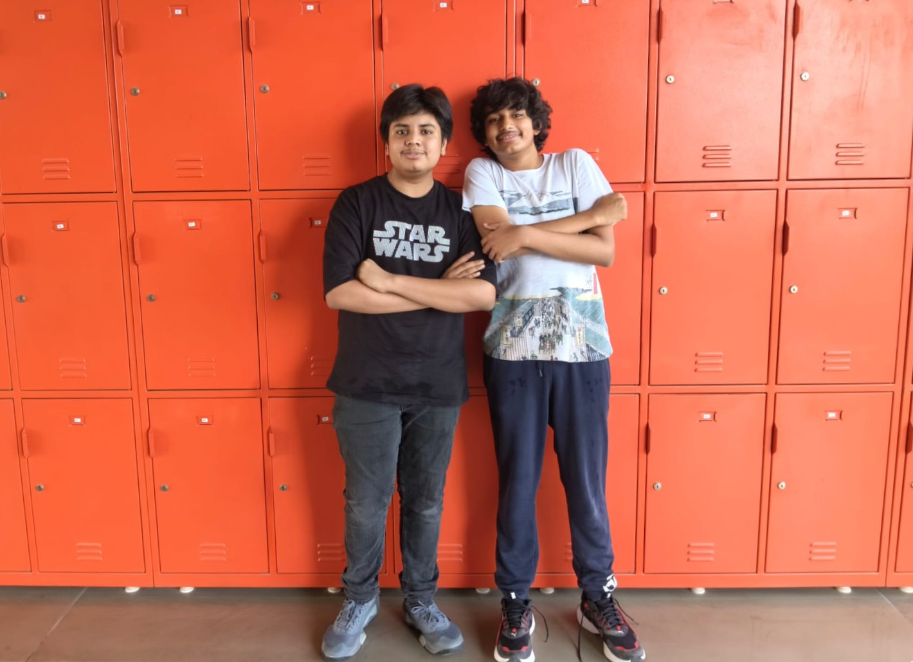
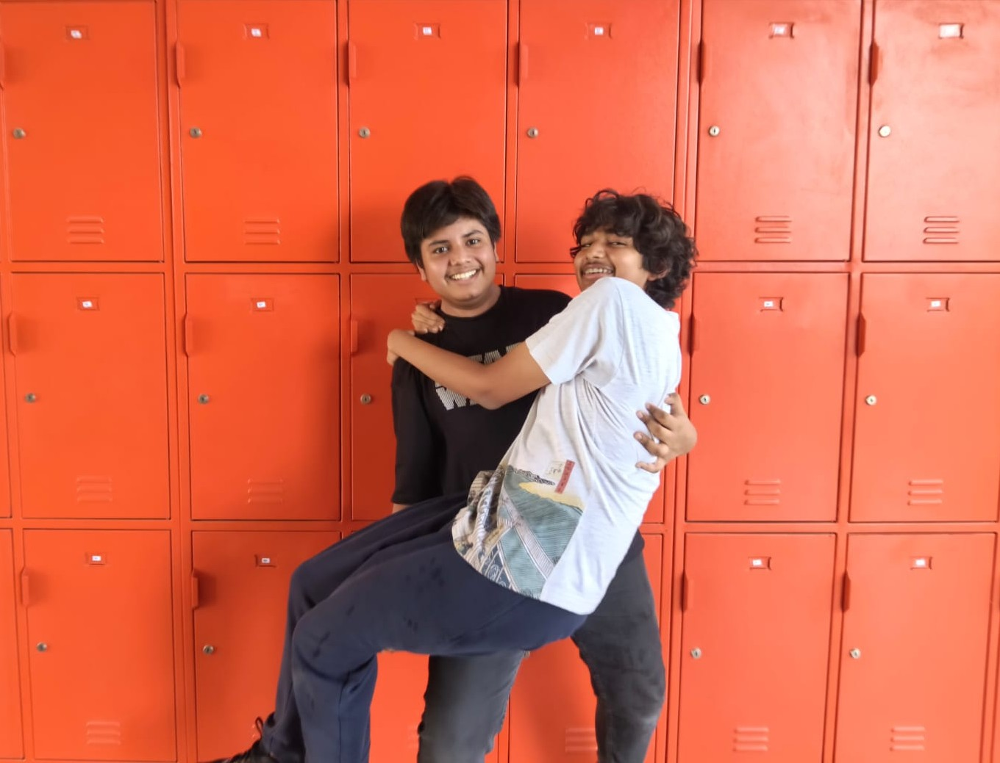

# 🏁 WRO 2026 Future Engineers — MadEngineerz

<div align="center">


**Small. Efficient. Simple.**

</div>

---

Welcome to the repository of **Team MadEngineerz**, competing in the **World Robot Olympiad™ Future Engineers 2026** category.

We set out to build a compact autonomous vehicle in which every part earns its place. The design philosophy is stated in three words in our own ideology document, and it is not decoration: it decided the chassis dimensions, the drivetrain, the electronics construction method and the software architecture. Where a simpler answer was sufficient, we took it. Where minimalism would have cost capability, we did not.

The vehicle measures **121 mm (L) × 83 mm (W) × 83 mm (H)**. The printed mechanical structure, with no electronics fitted, weighs **72.92 g**. That figure is the sum of every printed part in the build and not an estimate; the breakdown is published part by part in the [Models documentation](models/README.md).

Every mechanical component was designed by the team in Onshape and manufactured in-house. Every electrical connection was made by the team on perfboard. Every line of software was written by the team. This repository contains all of it, along with the research documents behind each decision.

---

## 📚 Table of Contents

- [📂 Complete Documentation Structure](#complete-documentation-structure)
- [👥 The Team](#the-team)
- [🎯 Challenge Overview](#challenge-overview)
- [🤖 Our Robot](#our-robot)
- [🧭 Engineering Philosophy](#engineering-philosophy)
- [⚙️ Mechanical Systems](#mechanical-systems)
- [🔧 Electronic Systems](#electronic-systems)
- [💻 Software Architecture](#software-architecture)
- [🔬 Research & Development](#research--development)
- [🧪 Testing & Iteration](#testing--iteration)
- [🛠️ Engineering Challenges](#engineering-challenges)
- [🚗 Vehicle Photos](#vehicle-photos)
- [🌐 GitHub Utilization](#github-utilization)
- [♻️ Replication](#replication)

---

## 📂 Complete Documentation Structure <a id="complete-documentation-structure"></a>

<div align="center">

### Each folder carries its own detailed technical README

| 📁 Folder | 🎯 Technical Content | 📖 Documentation |
|---|---|---|
| **⚙️ Models** | **Mechanical engineering**<br>• Onshape CAD and 3MF manufacturing files<br>• Chassis, steering and drivetrain design<br>• Transmission and speed analysis<br>• Design iteration record | [🔗 Models Documentation](models/README.md) |
| **🔌 Schemes** | **Electrical engineering**<br>• Complete wiring schematic<br>• Power distribution and consumption analysis<br>• Component pinouts and reference schematics<br>• Full bill of materials and datasheets | [🔗 Schemes Documentation](schemes/README.md) |
| **💻 Source** | **Software**<br>• Raspberry Pi vision and navigation<br>• Arduino Nano actuator control<br>• Serial protocol and failsafe<br>• Eight research documents | [🔗 Software Documentation](src/README.md) |
| **📚 Other** | **Research and references**<br>• Design ideology<br>• Steering and propulsion research<br>• Battery placement study<br>• Component reference images | [🔗 Other Resources](other/README.md) |
| **👥 Team Photos** | Official and informal team photographs | [🔗 Team Photos](t-photos/README.md) |
| **🚗 Vehicle Photos** | Six orthographic views with component identification | [🔗 Vehicle Photos](v-photos/README.md) |

</div>

---

## 👥 The Team <a id="the-team"></a>

MadEngineerz is a student robotics team competing in WRO 2026 Future Engineers. Between two members the project covers mechanical design and CAD, electronics, software, strategy and research, which is why the documentation in this repository spans all of those disciplines rather than one.

<div align="center">

| Member | Grade | Role |
|---|:---:|---|
| **Shubh Dalmia** — *Team Leader* | 10 | Electronics, Mechanical Design, CAD, Strategy, Research |
| **Daksh Gupta** | 9 | Electronics, Strategy Integration, Software, Research |

**Coach:** Vipin Kumar

</div>

<div align="center">


</div>
<p align="center">
  <em>Official and informal team photographs. Full documentation in <a href="t-photos/README.md">t-photos</a>.</em>
</p>

---

## 🎯 Challenge Overview <a id="challenge-overview"></a>

WRO Future Engineers sets two autonomous navigation problems on the same field. Our approach to each is summarised below and documented in full in the [Software Documentation](src/README.md).

### 🚀 Open Challenge

The vehicle navigates the track without obstacles, using the walls themselves as the reference.

```
Lane centering between the two walls, biased toward the inner wall
                              |
                              v
                Corner line detection (camera)
                              |
                              v
                    Corner line counting
                              |
                              v
                      11 lines counted
                              |
                              v
          Camera navigation yields to encoder odometry
                              |
                              v
        Drive a pre-calculated distance, then full stop
```

The control algorithm holds the vehicle centred between the inner and outer walls, with a deliberate bias toward the inner boundary to optimise cornering radii. Lap progress is tracked by counting corner marker lines through the camera. After the eleventh line the system changes state entirely: vision hands over to encoder odometry, which drives a known distance and stops.

### 🚧 Obstacle Challenge

The vehicle must pass red and green pillars on the correct side.

| Stage | Method |
|---|---|
| **Detection** | Raw YUV422 capture, U and V chrominance masking, red and green objects |
| **Centre calculation** | Mean X and Y of all masked pixels gives the pillar centroid |
| **Angle reference** | The camera is fixed on the chassis centreline, so the frame centre is 0° |
| **Relative angle** | Pixel offset between the pillar centroid and the frame centreline |
| **Avoidance** | Colour determines which side; angle determines how hard |
| **Steering** | PID control of the steering servo |

The target avoidance angle decreases approximately linearly as the pillar's pixel footprint grows, which indicates closing distance. The result is a smooth sweeping curve around a pillar rather than a late swerve.

### 📐 Where the mechanical engineering evidence sits

The mechanical evaluation looks at chassis design choices, the steering and drive mechanism, torque and speed reasoning, stability and rigidity, and the justification behind each decision. This table points to where each is evidenced rather than asserted.

| Evaluation area | Where it is documented |
|---|---|
| **Chassis design choices** | [Two-part chassis](#mechanical-systems) here, full reasoning and load-path analysis in [Models](models/README.md) |
| **Steering mechanism** | [Ackermann steering](#mechanical-systems), including why the short wheelbase makes the geometry matter more |
| **Drive mechanism** | [Rear-wheel drive and spur gear transmission](#mechanical-systems), including why the drive path is a straight shaft |
| **Torque and speed reasoning** | The 4:3 step-up derivation below, with the torque trade-off and why it suits this mass |
| **Stability and rigidity** | Closed-box architecture, 3 mm walls, eight-screw interface, sealed bearings; full table in [Models](models/README.md) |
| **Justification of design choices** | Every decision in this document is given with its reason; summarised in the [Models engineering summary](models/README.md) |
| **Testing used to refine the design** | [Testing & Iteration](#testing--iteration), with seven documented alternatives evaluated and rejected |

---

## 🤖 Our Robot <a id="our-robot"></a>

<div align="center">


</div>
<p align="center">
  <em>Left: complete CAD assembly. Right: the electronics deck on the upper chassis section, carrying the Raspberry Pi Zero 2 W, the Arduino Nano and the BNO085 IMU on a custom perfboard.</em>
</p>

### Mechanical architecture

| Feature | Implementation |
|---|---|
| Steering | Ackermann geometry on the front axle |
| Drive | Rear-wheel drive on a solid axle |
| Transmission | Spur gear pair, 20 T motor pinion to 15 T axle gear, a 4:3 step-up |
| Motor | N20 metal gear motor, 500 RPM output, with encoder |
| Chassis | Two-part construction, upper and lower sections joined by 8 M2 screws |
| Walls | 3 mm structural walls on both sections |
| Mounting | Components mounted directly to the printed structure, no intermediate brackets |
| Electronics access | Dedicated upper section forming a detachable electronics deck |
| Mass | 72.92 g printed structure, electronics excluded |
| Envelope | 121 × 83 × 83 mm |

### Electronic architecture

| Subsystem | Devices |
|---|---|
| Compute | Raspberry Pi Zero 2 W |
| Vision | Raspberry Pi Camera |
| Real-time control | Arduino Nano |
| Orientation | BNO085 IMU |
| Distance sensing | 1 × VL53L1X, 3 × VL53L3CX |
| Bus expansion | TCA9548A I²C multiplexer |
| Propulsion | TB6612FNG driver, 500 RPM N20 motor |
| Steering | EMAX ES08MA II servo |
| Power | MP1584 buck converter, 2S LiPo pack |

---

## 🧭 Engineering Philosophy <a id="engineering-philosophy"></a>

Our ideology document reduces the whole project to three words: **small, efficient, simple**. Weight is treated as a resource to be spent, not a number to be minimised at any cost. The chassis is kept as small as practical to reduce material, mass and footprint. Components are reduced to the minimum required to reach the performance we need.

The most important consequence is stated explicitly in our own research: the robot is designed *as* a compact vehicle rather than as a scaled-down large one. A 72.92 g car does not behave like a small version of a heavy car, and the mechanical decisions follow from that rather than from convention.

| Domain | How the philosophy shows up |
|---|---|
| **Chassis** | 121 × 83 × 83 mm envelope fixed at concept stage, so every later packaging decision was a real constraint |
| **Weight** | Wall thickness refined from 4 mm to 3 mm, and the upper frame lightened, because the two chassis halves are 64.9 g of the 72.92 g total |
| **Mechanical** | Simple geometry and a minimal part count to reduce failure points |
| **Electronics** | Perfboard rather than a fabricated PCB, so the circuit can change as fast as the design does |
| **Software** | Lightweight Python, a NumPy channel mask instead of a vision framework, readable serial strings instead of binary packets |
| **Manufacturing** | Everything printed in-house, so a revision costs a print rather than a lead time |
| **Maintenance** | A detachable electronics deck and JST connectors so a module can be swapped without desoldering |

---

## ⚙️ Mechanical Systems <a id="mechanical-systems"></a>

Full detail, including the complete manufacturing file repository, is in the [Models Documentation](models/README.md).

### Core specifications

| Parameter | Value |
|---|---|
| Dimensions | 121 mm (L) × 83 mm (W) × 83 mm (H) |
| Wheelbase | 67 mm |
| Front track | 85 mm |
| Printed structure mass | 72.92 g |
| Structural wall thickness | 3 mm, both sections |
| Wheels | LEGO 87697, 21 mm diameter × 12 mm wide |
| Bearings | 626-2RS on the rear axle, 684-2RS at the front wheels |
| Fasteners | M2 throughout |

### 🔄 Ackermann steering

<div align="center">


</div>
<p align="center">
  <em>Mirrored steering knuckle with clevis, stub axle and M2 kingpin bore, and the linkage that drives both knuckles from a single servo input at its centre hole.</em>
</p>

In a turn the inner and outer front wheels travel on circles of different radii about the same centre. Steering both to the same angle forces at least one wheel to point away from its direction of travel, and the difference is absorbed as tyre scrub. Ackermann geometry steers the inner wheel through a larger angle than the outer, so a perpendicular from each front wheel meets a perpendicular from the rear axle at one common point and both wheels roll along their true paths.

**Why it matters more on this vehicle.** Our wheelbase (67 mm) is shorter than our track (85 mm), which is an unusual proportion and a direct consequence of packaging a 121 mm car. The shorter the wheelbase relative to the track, the further the inner and outer steer angles must diverge for correct geometry. A long vehicle can approximate Ackermann with a nearly parallel linkage and lose very little. Ours cannot, so the geometry was set from the outset rather than approximated.

The benefit is not only efficiency. Scrub varies with surface, load and speed, so removing it makes the relationship between commanded steering angle and actual path repeatable, which is what an autonomous vehicle depends on.

**Actuator:** EMAX ES08MA II metal gear micro servo, selected for compact size, low mass, adequate torque and precise positioning. The metal gear train is the decisive property: the linkage transmits impact loads back into the servo whenever a wheel meets an obstruction.

### 🔧 Rear-wheel drive and spur gear transmission

<div align="center">


</div>
<p align="center">
  <em>The 20 T motor pinion, the 15 T axle gear, and the drive axle whose cross-profile ends transmit torque to the rims by positive form lock rather than friction.</em>
</p>

**Why rear-wheel drive.** It separates steering from propulsion. A front-wheel-drive layout would require the drive path to accommodate a steering angle, which means flexible couplings or constant-velocity joints, both difficult to produce at this scale by FDM printing and both sources of play in the steering. Driving the rear axle keeps the drive path a single straight shaft and leaves the front axle a pure steering mechanism.

**Why spur gears.** A spur pair transmits torque between parallel shafts with no axial thrust component to react into printed plastic, and its entire tooth profile lies in one print layer plane, which is the geometry FDM reproduces most faithfully at this tooth size. Helical and double-helical forms were modelled and evaluated before the plain spur pair was adopted.

**Why this ratio.** The 20 T pinion drives the 15 T gear, so this is a step-up:

```
i        = 20 / 15 = 1.333        (4:3)
n_wheel  = 500 × 1.333 = 666.7 RPM
v        = π × 0.021 × (666.7 / 60) = 0.73 m/s     (theoretical, no load)
```

Torque moves the other way: whatever the ratio multiplies in speed, it divides in torque. On a vehicle of this mass, running on all four wheels in sealed ball bearings across a hard flat surface, the tractive force required is small. The useful margin is in lap time, not pulling force, so spending torque headroom to buy speed is the correct direction here and would be the wrong direction on a heavier vehicle. The step-up is also deliberately modest: a more aggressive ratio would raise reflected inertia with the square of the ratio and would diverge the gear diameters, which costs package volume in a 121 mm car.

### 🏗️ Two-part chassis

<div align="center">


</div>
<p align="center">
  <em>Upper section, an open lightened frame carrying the electronics deck, and lower section, a tray carrying the drivetrain and steering loads with paired kingpin lugs at each corner.</em>
</p>

The structure has to be stiff and it has to open. A single monolithic shell would either enclose the mechanism completely, making it unserviceable, or need large open faces that remove the very material providing stiffness. Splitting it lets each half be a closed-perimeter part in its own right, and the **8 M2 screws** across the interface recover the stiffness at the seam and hold the halves square. Joined, the two sections form a closed box, which is far stiffer in torsion than either half alone.

The load paths decided where material could be removed. The lower tray carries the drivetrain and steering loads and keeps its material. The upper frame carries only the electronics deck, so it was lightened using the **Lighten FeatureScript in Onshape**, which produced the aperture pattern visible above while leaving the closed perimeter rails that provide its torsional stiffness. The result is 26 g for the upper section against 38.9 g for the lower.

Components mount **directly to the printed structure** with no intermediate brackets. Every bracket would add mass, two more interfaces that can move, and tolerance stack. For the camera in particular, any compliance between the sensor and the wheels changes the relationship between what the robot sees and where it actually is.

### 🖨️ CAD and manufacturing

| Stage | Tool |
|---|---|
| CAD | Onshape |
| Manufacturing preparation | Part orientation and plate arrangement |
| Slicing | Bambu Studio |
| Printing | Bambu Lab A1 |
| Material | PLA |

```
Onshape → CAD Design → Manufacturing Preparation → Bambu Studio → 3D Printing → Assembly → Testing
```

PLA offers the highest stiffness of the common FDM materials along with excellent dimensional accuracy, which is the property this design actually depends on: the bearing seats, gear bores and screw interfaces all rely on printed dimensions landing within tolerance.

Manufacturing files are published in **3MF** rather than STL or vendor G-code. 3MF is an open format read by all major slicers, it retains the print configuration alongside the geometry, and it preserves the orientation and plate arrangement, which matters because orientation determines the direction of the layer lines relative to the loads and the printed bores. It does not guarantee identical output on every printer, since nozzle, extrusion system, calibration and filament all vary, but it preserves our configuration as the starting point.

We publish 3MF deliberately rather than native CAD source, so that another team can manufacture the robot exactly as designed while the design itself remains our own work.

### Manufacturing file repository

<div align="center">

| Component | File | Qty | Preview | Description |
|---|---|---:|---|---|
| **Bottom chassis** | [`Bottom part.3mf`](models/Bottom%20part.3mf) | 1 |  | Primary load-carrying tray, 3 mm walls, integrated steering lugs. 38.9 g |
| **Top chassis** | [`Top Part.3mf`](models/Top%20Part.3mf) | 1 |  | Lightened upper frame carrying the electronics deck. 26 g |
| **Drive axle** | [`Axle.3mf`](models/Axle.3mf) | 1 |  | Runs in two 626-2RS bearings, cross-profile ends. 2.30 g |
| **Axle gear (15 T)** | [`Axle gear.3mf`](models/Axle%20gear.3mf) | 1 |  | Driven gear of the transmission pair. 0.30 g |
| **Motor gear (20 T)** | [`Motor Gear.3mf`](models/Motor%20Gear.3mf) | 1 |  | Driving pinion on the N20 D shaft. 0.60 g |
| **Motor mount** | [`Motor mount.3mf`](models/Motor%20mount.3mf) | 1 |  | Fixes the N20 and sets the gear centre distance. 1.19 g |
| **Rear wheel rim** | [`Rear wheel rim.3mf`](models/Rear%20wheel%20rim.3mf) | 2 |  | Adapter between axle end and LEGO 87697 wheel. 0.70 g each |
| **Steering arm, left** | [`steering_arm_left.3mf`](models/steering_arm_left.3mf) | 1 |  | Left knuckle, clevis, stub axle, M2 kingpin bore. 0.80 g |
| **Steering arm, right** | [`steering_arm_right.3mf`](models/steering_arm_right.3mf) | 1 |  | Mirrored right knuckle. 0.80 g |
| **Steering linkage** | [`steering_linkage.3mf`](models/steering_linkage.3mf) | 1 |  | Outer holes to the knuckles, centre hole to the servo. 0.63 g |

</div>

### Mechanical engineering approach

**1. Conceptual design and requirements analysis.** Work started on paper, with a large number of sketches exploring vehicle layout, subsystem arrangement and component packaging before any CAD. Sketching is far faster than modelling for comparing alternatives, so unworkable layouts were set aside at the cost of a page. This stage produced the architecture: Ackermann steering, rear-wheel drive, and the fixed 121 × 83 × 83 mm envelope from which the wheelbase and track follow.

**2. Precision CAD modelling.** Every part was modelled parametrically in Onshape, with the interfaces that hold the design together defined as driven dimensions: gear centre distance, bearing seats, kingpin spacing, the screw pattern between the halves. Building the complete assembly rather than isolated parts is what allowed interference and packaging to be resolved in the model.

**3. Prototyping and optimisation.** The design iterations recorded below were carried out here, comparing alternatives directly against one another in the parametric assembly.

**4. Production engineering and validation.** Parts were prepared in Bambu Studio, printed in PLA on the Bambu Lab A1, and assembled with M2 fasteners and sealed bearings into the vehicle documented in this repository.

---

## 🔧 Electronic Systems <a id="electronic-systems"></a>

Complete electrical documentation, including the wiring schematic, all pinouts and every datasheet, is in the [Schemes Documentation](schemes/README.md).

### Bill of materials

<div align="center">

| Component | Image | Qty | Function |
|---|---|---:|---|
| **Raspberry Pi Zero 2 W** |  | 1 | Main vision processor. Hosts the camera and the I²C bus, links to the Nano over UART |
| **Raspberry Pi Camera** |  | 1 | Primary visual sensor for track layout, pillar and corner line recognition |
| **Arduino Nano** |  | 1 | Low-level real-time controller for motor drive and encoder pulses |
| **BNO085** |  | 1 | 9 DoF orientation IMU with on-board sensor fusion |
| **VL53L1X** |  | 1 | Time-of-Flight ranging, up to 400 cm, 27° typical full field of view |
| **VL53L3CX** |  | 3 | Time-of-Flight ranging with multi-target detection, 25° typical full field of view |
| **TCA9548A** |  | 1 | 8 channel I²C multiplexer, one channel per ranging sensor |
| **TB6612FNG** |  | 1 | H-bridge motor driver for the drive motor |
| **MP1584** |  | 1 | Step-down switching buck converter producing the regulated logic rail |
| **500 RPM N20** |  | 1 | Metal gear DC motor with encoder, drives the rear axle |
| **EMAX ES08MA II** |  | 1 | Metal gear micro servo, steering actuator |

</div>

### ⚡ Electrical design philosophy

The electrical system was built so that the team could assemble, modify, troubleshoot and maintain every part of it ourselves. Several decisions follow directly from that.

**Switching regulation over linear.** Logic and sensing are supplied through a high-efficiency buck converter rather than a linear regulator such as an LM7805. A linear part dissipates the voltage difference as heat, and in a compact chassis that heat has nowhere to go while the wasted energy shortens usable run time.

**Noise isolation by topology.** The layout separates clean logic lines from high-noise inductive loads. The motor and the driver draw directly from the pack or from dedicated converter lines, so the PWM drive commands and the high-frequency encoder pulses stay clear of electromagnetic interference and ground bounce. That isolation is not incidental: the encoder is the vehicle's source of distance for dead reckoning, and a corrupted pulse train degrades position tracking directly.

**Modular cabling.** All sensors, power rails and actuators use polarised JST connectors, so a component can be swapped instantly during troubleshooting in pit conditions without re-soldering.

**Accessible compute.** The compute boards, the multiplexer and the IMU sit at the top of the vehicle in a detachable assembly, giving direct access for debugging, wiring, last-minute changes and flashing code.

### 🔨 Custom perfboard-based electronics

Our electronics are built on **custom perfboard** rather than a professionally manufactured PCB. This is a deliberate choice suited to how the robot was developed, not a claim that perfboard is better in general. A fabricated PCB gives a more finalised and more compact result, and for a settled design it is the better answer. The difference is what happens when the design changes: a PCB change generally requires another board revision and another manufacturing cycle, whereas the perfboard circuit can be modified directly, in place.

<div align="center">

| Aspect | Professional PCB | Our perfboard system |
|---|---|---|
| Development | Fixed after manufacturing | Easily modified |
| Modification | Requires a board revision | Direct modification |
| Development cost | Higher for repeated revisions | Low |
| Hands-on experience | Lower | High |
| Component replacement | More difficult | Easier |
| Manufacturing | External fabrication | In-house |
| Flexibility | Lower after fabrication | High |

</div>

Three devices are mounted on the perfboard itself: the **Raspberry Pi Zero 2 W**, the **Arduino Nano** and the **BNO085 IMU**. Everything else connects up from below, from wherever it sits in the chassis. The processors and the IMU have no reason to be anywhere but the deck, while the camera, the ranging sensors, the driver, the motor and the servo must sit where their function places them. Making the perfboard the single upper interconnection point means each distributed device needs one run up to a common landing rather than a web of connections between themselves.

### 🔌 Wiring, power and cable management

**Wiring.** The complete digital wiring schematic is published as [`WIRING.pdf`](schemes/WIRING.pdf) and is the source of truth for every electrical connection: the battery, the MP1584 input and output, the Raspberry Pi GPIO header, the Arduino Nano and its USB bus, the TB6612FNG and the N20 motor, the servo, the TCA9548A and its downstream ranging sensors, and the common ground.

**Power distribution.** A 2S LiPo pack supplies the vehicle. The motor driver is the only device that takes the raw pack voltage; everything else sits behind the buck converter and is insulated from the voltage sag the motor causes when it loads. Because most of the sensing hardware tolerates either 3.3 V or 5 V, the rail count stays low rather than requiring separate regulation per sensor family. Common ground is the negative terminal of the pack, giving every device one fixed voltage reference. Rail assignments and the full consumption analysis are in [`Power System..pdf`](schemes/Power%20System..pdf) and summarised in the [Schemes Documentation](schemes/README.md).

**Cable management.** The vehicle has a relatively large open central region between the upper and lower chassis sections, and the cabling is built around that space rather than around routing hardware. Wiring from the upper portion and from the lower portion both meet there, so the cabling is a set of short runs into one area instead of long runs across the vehicle. Connections converge at one identifiable region, so a wire can be traced from either end. The two halves can be wired and checked separately and then joined. Separating the sections exposes the whole cable run at once for maintenance. And routing through the centre keeps cabling clear of the steering linkage and the rear axle and gear pair, the only moving parts that could catch a wire.

---

## 💻 Software Architecture <a id="software-architecture"></a>

Full implementation detail, including code excerpts and an explicit implementation status table, is in the [Software Documentation](src/README.md).

```
+---------------------------------------------------------------+
|                        RASPBERRY PI                           |
|                          (Python 3)                           |
|                                                               |
|   Camera  ->  Vision pipeline      Time-of-Flight array       |
|   Rotary encoder odometry          High level navigation      |
|                    Steering PID calculation                   |
+-------------------------------+-------------------------------+
                                |
                                |  Serial, ASCII string messages
                                |  115200 baud
                                v
+---------------------------------------------------------------+
|                        ARDUINO NANO                           |
|                       (Embedded C++)                          |
|   Servo steering angle execution                              |
|   DC motor direction and PWM speed control                    |
+-------------------------------+-------------------------------+
                                |
                       +--------+--------+
                       |                 |
                       v                 v
                 Steering servo     Drive motor
```

**Why the split.** The Pi is the only platform on the robot capable of running a camera pipeline, and it is a poor platform for deterministic timing because it runs a general-purpose operating system. The Nano is the reverse. Giving each task the platform suited to it means the vision loop can take as long as it needs without stalling the motor, while the servo pulse train and the PWM stay deterministic regardless of what the Pi is doing.

The split also creates a clean failure boundary. The Nano holds the last commanded values and runs its own watchdog, so a stall on the Pi stops the motor rather than leaving it running at the last commanded speed.

### Development and deployment

| Platform | Language | Deployment |
|---|---|---|
| Raspberry Pi | Python 3 | SSH over direct Ethernet or a dedicated hotspot |
| Arduino Nano | C++ | Arduino IDE over a direct USB serial link |

Competition rules restrict external discrete LEDs, so system boot and script execution are indicated using the Raspberry Pi's onboard green ACT LED mapped through GPIO triggers. It confirms that the system has started, and nothing more.

### Serial communication

The link uses **human-readable ASCII strings rather than binary packets**, because strings are easier to read on a terminal, easier to debug when a value looks wrong and easier to modify when a field changes. The cost is a small reduction in efficiency, accepted deliberately.

```
$<servoAngle>,<motorSpeed>\n
```

`$` marks the start of a valid payload, the comma separates the fields and the newline terminates it. The Nano parses the string, replies `OK`, and runs a **200 ms watchdog**: if no valid packet arrives within that window the drive throttle is forced to zero and the built-in LED lights as a warning. Because the timer only refreshes on a successful parse, a corrupted stream triggers the failsafe just as a disconnected cable would. This is what makes the Pi's non-deterministic timing safe to build on.

### Vision

```
Raw camera feed → YUV422 capture → discard Y channel
      → threshold masks on U and V → NumPy vectorised pixel mean → relative angle
```

Obstacle processing runs in ten steps:

1. Capture raw YUV422
2. Take the U and V chrominance channels
3. Discard Y for the colour detection step
4. Apply the colour mask
5. Detect red and green regions
6. Calculate the mean X and Y coordinates of the matching pixels
7. Take that mean as the obstacle centre
8. Measure the relative angle from the frame centreline
9. Determine the avoidance direction from colour and angle
10. Apply the correction through PID steering

The pipeline is specified as QQVGA at approximately 70 FPS in raw YUV422. Converting every frame to BGR or HSV would cost processing time the Pi Zero 2 W does not have, so raw YUV422 is captured directly and the luminance channel is discarded, leaving the two chrominance channels from which a colour mask is built by indexing rather than transforming. The centroid is the arithmetic mean of the matching pixel coordinates, which returns a position in milliseconds without contour fitting or blob analysis. The camera provides block detection, corner line detection, turning decisions and obstacle detection.

### Sensor roles

| Sensor | Primary role | Priority behaviour |
|---|---|---|
| **Camera** | Primary navigation | Relative target angles for cornering, pillar detection and track colour lines. Holds primary control during open track driving |
| **Rotary encoder** | Odometry and distance | Physical movement tracking for parking manoeuvres and final lap completion |
| **Time-of-Flight** | Spatial safety net | Continuously monitors close proximity and acts as a fail-safe override, forcing corrective steering near a wall and overriding camera input |

The hierarchy is contextual rather than a fixed blend. The camera leads on open track, the encoder leads where position matters more than vision, and the ToF array can pre-empt both when a collision is imminent. That inversion is the point of the ToF sensors: a wall at close range is a situation where the camera's judgement is not allowed to win.

### Implementation status

The camera pipeline, both sides of the serial protocol and the watchdog failsafe are implemented and running. The PID steering loop, the reference angle module, corner line detection and counting, lane centering, odometry, ToF handling and sensor fusion arbitration are designed and documented but not yet written. Two of the five source files are test routines rather than control software. The [Software Documentation](src/README.md) states the status of every capability item by item rather than leaving it to be inferred.

---

## 🔬 Research & Development <a id="research--development"></a>

Design decisions in this project were researched before they were built. The research documents are published in full alongside the code and models.

| Research | Document | What it decided |
|---|---|---|
| **Design ideology** | [`Ideology..pdf`](other/Ideology..pdf) | The small, efficient, simplistic principle and how it applies across mechanical, electrical and software design |
| **Steering and propulsion** | [`Hardware..pdf`](other/Hardware..pdf) | Ackermann selection and servo choice, plus a comparison of three transmission options: spur gear drive, timing belt drive and rear differential drive |
| **Battery placement** | [`Battery plan.pdf`](other/Battery%20plan.pdf) | Where the battery sits and how rear axle loading affects Ackermann steering authority |
| **Code architecture** | [`Code Architecture..pdf`](other/Code%20Architecture..pdf) | Sensor reliance, software structure and the parking approach |
| **Electrical philosophy** | [`Electrical_design_Philosophy.pdf`](schemes/Electrical_design_Philosophy.pdf) | Power architecture, noise isolation, sensor fusion strategy, communication and serviceability |
| **Power system** | [`Power System..pdf`](schemes/Power%20System..pdf) | Rail assignments, distribution architecture and consumption analysis |
| **Software research** | [Eight documents in `src/`](src/README.md) | Core components, vision pipeline, navigation strategies, sensor fusion, build process, dependencies, challenges, known issues |

One example of research changing the design: the battery study established that mass carried on the solid rear axle reduces the load on the Ackermann-steered front axle, and therefore reduces steering authority. That relationship constrains battery position at both ends, and it is why the pack sits above the drivetrain rather than at the rear.

Complete resource index in [Other Resources](other/README.md).

---

## 🧪 Testing & Iteration <a id="testing--iteration"></a>

### Mechanical design iteration

The mechanical design reached its current form through two phases: sketching on paper, then evaluation in the parametric CAD assembly. Each alternative below was modelled and compared before one was adopted.

<div align="center">

| # | Subsystem | Alternatives evaluated | Outcome |
|---|---|---|---|
| 1 | Transmission ratio | Multiple tooth count combinations modelled | 20 T motor and 15 T axle (4:3) adopted |
| 2 | Gear type | Helical and double-helical gears modelled | Plain spur gear pair adopted |
| 3 | Wall thickness | 4 mm walls | Refined to 3 mm |
| 4 | Chassis architecture | Single-piece chassis | Split into two sections |
| 5 | Rear drive | Mechanical differential considered | Spur gear drive on a solid axle adopted |
| 6 | Upper section mass | Solid upper frame | Lightened with the Onshape Lighten FeatureScript |
| 7 | Component layout | Multiple component positions | Fixed once weight distribution and packaging were satisfactory |

</div>

Because both gears are small printed parts, evaluating a ratio was inexpensive, which is what made comparing several combinations practical rather than picking one at the outset. The same is true of the wall thickness change: the chassis sections are 64.9 g of the 72.92 g total, so wall thickness is the single largest lever on vehicle mass, and a 25% reduction acts on the two largest parts in the vehicle.

The differential decision is recorded with its consequence accepted rather than hidden. A solid axle constrains both rear wheels to the same speed, so some rear scrub occurs in a turn. At this mass the resulting forces are small, while a printed differential would have added several gears, bearing surfaces and a housing to the one subsystem that transmits continuous load. Reduced scrub is delivered at the front axle by the Ackermann geometry, where the steering angles make it matter most.

### Hardware validation

The manufacturing files published here were printed and assembled into the complete vehicle. That confirms the dimensional interfaces designed in CAD transfer correctly to printed parts and function together: the bearing seats, the gear centre distance set by the motor mount, the cross profile between axle and rim, the kingpin lugs and the eight-screw chassis interface.

### Software refinement

Both documented software challenges below were resolved through iteration rather than first-attempt design, and one of them changed the detection algorithm that the vehicle still uses.

Quantitative mechanical testing, meaning measured steering angles, turning radius, vehicle speed under load and structural deflection, is the next stage of work. No numerical values for those are claimed anywhere in this repository.

---

## 🛠️ Engineering Challenges <a id="engineering-challenges"></a>

### SSH access to the Raspberry Pi

**Challenge.** SSH over Wi-Fi through VS Code could not be made to work despite extended effort. Without SSH there was no way to test the code at all, because most of the libraries it depends on only run on the Raspberry Pi itself.

**Approach.** Multiple solutions were attempted over hours before the approach was changed rather than continued.

**Solution.** Wi-Fi was dropped entirely in favour of Ethernet. It was later found that a hotspot configured to WPA2 on an older phone was the only way to get the Pi Zero to connect to a network at all.

**Current status.** Deployment runs over SSH via direct Ethernet, with the WPA2 hotspot available for network connectivity. SSH itself still requires the direct Ethernet connection to a laptop.

### Obstacle detection performance

**Challenge.** The obstacle detection algorithm worked, but it was slow, reported a low frame rate, struggled under varying lighting, and overloaded the CPU of a test Raspberry Pi 3, which is considerably more powerful than the Zero the robot actually carries. It also drew bounding boxes above the obstacles rather than on them.

**Approach.** The problem was traced to how the detection defined an obstacle's position.

**Solution.** The algorithm was changed to work from the centre of an obstacle rather than from its corner.

**Current status.** The pipeline is centroid based, computing the mean X and Y of the masked pixels. This is what runs today and what will feed the PID avoidance algorithm.

### Packaging within a 121 mm envelope

**Challenge.** Fixing the envelope at concept stage meant every subsystem had to fit a space decided before any of them were designed.

**Approach.** The complete assembly was modelled in Onshape rather than individual parts, so interference and packaging could be resolved in the model, and component positions were moved repeatedly until both weight distribution and layout were satisfactory.

**Solution.** Mounting features are dimensioned to the components they hold, so each component's own body becomes part of the assembly's dimensional chain rather than sitting on a bracket.

**Current status.** The final layout is the one documented in the [Vehicle Photos](v-photos/README.md), with a wheelbase of 67 mm and a track of 85 mm following from the envelope.

---

## 🚗 Vehicle Photos <a id="vehicle-photos"></a>

Six orthographic views document the vehicle from every principal direction, each annotated with the components it makes visible.

<div align="center">


</div>
<p align="center">
  <em>Front view showing the camera and front steering assembly; right view showing the motor installation and the chassis interface; bottom view showing the drivetrain, the spur gear pair and the Ackermann steering mechanism.</em>
</p>

Complete set with per-view component identification in [Vehicle Photos](v-photos/README.md).

---

## 🌐 GitHub Utilization <a id="github-utilization"></a>

This repository is organised so that the project can be understood, inspected, manufactured and modified by someone who was not involved in building it.

<div align="center">

| Asset type | Location | Role |
|---|---|---|
| Manufacturing files | [`models/`](models/README.md) | 3MF files for every printed part, with quantities, masses and previews |
| Mechanical documentation | [`models/README.md`](models/README.md) | Design reasoning, transmission analysis, iteration record |
| Electrical schematics | [`schemes/`](schemes/README.md) | Complete wiring schematic and per-component reference schematics |
| Datasheets and pinouts | [`schemes/`](schemes/README.md) | Manufacturer datasheets for every electronic component |
| Source code | [`src/`](src/README.md) | Python and C++ sources with documented implementation status |
| Research | [`other/`](other/README.md) and [`src/`](src/README.md) | The design studies behind each major decision |
| Photographs | [`v-photos/`](v-photos/README.md), [`t-photos/`](t-photos/README.md) | Vehicle views and team documentation |

</div>

Each folder carries its own README rather than deferring everything to this page, so a judge or a reader can go directly to the discipline they care about. This root document explains the engineering decisions and points to the depth; it does not duplicate it.

Two conventions are worth noting. Research documents are published as they were written, including the ones that were later superseded by a design change, so the reasoning is visible and not only the conclusion. And the software documentation states which capabilities are implemented and which are designed but not yet written, rather than describing planned work as finished.

---

## ♻️ Replication <a id="replication"></a>

The repository is intended to let another team understand and reproduce this project.

| To reproduce | Use |
|---|---|
| The mechanical structure | 3MF manufacturing files with orientation and print configuration preserved, plus per-part quantities and masses |
| The electronics | Complete wiring schematic, bill of materials, pinouts and manufacturer datasheets |
| The power system | Rail assignments, distribution architecture and consumption analysis |
| The software | Full Python and C++ sources, the serial protocol specification and eight research documents |
| The assembly | Fastener specification, bearing designations, and six orthographic views showing component placement |
| The reasoning | Research documents and the iteration record, so decisions can be evaluated rather than only copied |

Some honesty about the limits. The software is partially implemented, and the documentation says which parts. Quantitative mechanical test data does not yet exist. A team reproducing this robot would be reproducing a design that is complete mechanically and electrically, and in progress in software.

We publish 3MF rather than native CAD source deliberately: another team can manufacture the robot exactly as we designed it, while the design itself remains our own work.

---

---

<div align="center">

## 📚 Documentation Hub

| | |
|---|---|
| ⚙️ **Mechanical design and manufacturing** | [Models Documentation](models/README.md) |
| 🔌 **Electrical schematics and power** | [Schemes Documentation](schemes/README.md) |
| 💻 **Software implementation** | [Software Documentation](src/README.md) |
| 📚 **Research and component references** | [Other Resources](other/README.md) |
| 👥 **Team** | [Team Photos](t-photos/README.md) |
| 🚗 **Vehicle** | [Vehicle Photos](v-photos/README.md) |

### Team MadEngineerz — WRO 2026 Future Engineers

**Small. Efficient. Simple.**

</div>
