# Mechanical Design — Models Documentation

**Team MadEngineerz · WRO 2026 Future Engineers**

This folder contains the manufacturing files and mechanical documentation for our autonomous vehicle. Every mechanical component in the robot was designed by the team in Onshape and manufactured in house on a Bambu Lab A1. This document explains not only what we built, but why each mechanical decision was made and what it delivers elsewhere in the design.

## Contents

* Mechanical Design Overview
* Design Philosophy
* Mechanical Specifications
* Chassis Architecture
* Ackermann Steering System
* Rear Wheel Drive and Spur Gear Transmission
* Transmission and Speed Analysis
* Mechanical Stability and Rigidity
* Design Iteration
* CAD and Manufacturing Workflow
* Why 3MF
* Complete Manufacturing File Repository
* Engineering Approach
* Validation
* Engineering Summary

## Mechanical Design Overview

<p align="center">
  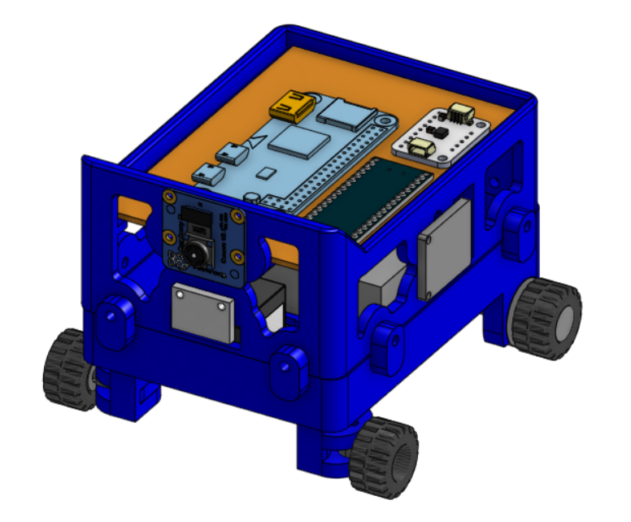
  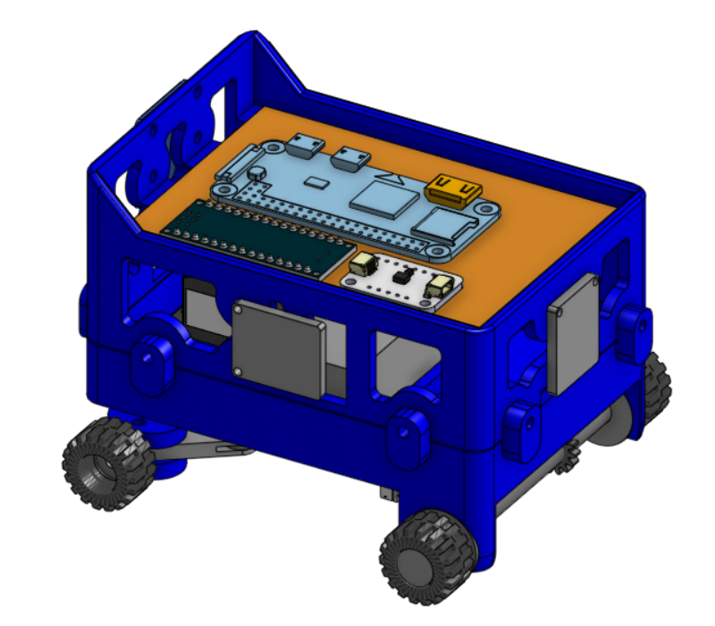
</p>
<p align="center">
  <em>Complete CAD assembly. The two part chassis carries all subsystems directly: the compute board and perfboard sit on the upper deck, the camera is mounted to the front structure, and the steering and drive hardware are packaged inside the lower section between the wheels.</em>
</p>

The vehicle is a four wheel car type platform with **Ackermann steering on the front axle** and **rear wheel drive through a spur gear pair**. This layout separates the steering function from the propulsion function, which keeps each mechanism simple enough to design, print and service as an independent subassembly.

<p align="center">
  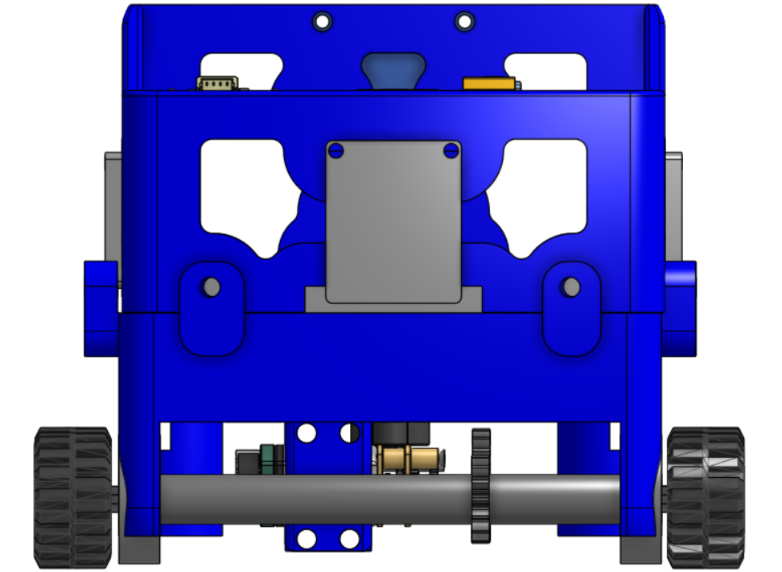
</p>
<p align="center">
  <em>Additional view of the complete assembly showing the packaging relationship between the drivetrain, steering hardware and the electronics deck.</em>
</p>

## Design Philosophy

Our mechanical design is built around **minimalism**: the smallest, lightest structure that still holds every component rigidly and in the right place. This is a deliberate engineering position rather than an aesthetic one, and it drove the following objectives.

| Objective | Why it matters mechanically |
|---|---|
| Keep the robot small | A shorter vehicle needs less clearance to complete a turn inside a fixed track width, and reduces the moment arm of any mass offset from the wheelbase. |
| Keep the robot lightweight | Lower mass means lower inertia to accelerate and decelerate, and lower load on every printed joint, bearing seat and gear tooth. |
| Maintain stability and rigidity | A structure that stays true under load keeps the wheels and camera in a fixed relationship, which preserves both steering accuracy and vision geometry. |
| Maintain optimal performance | Mechanical choices are made to serve the drive and steering behaviour, not the other way round. |
| Practical to assemble and maintain | Parts that can be removed and refitted quickly are parts that can be adjusted between runs at a competition. |

Every decision documented below traces back to one or more of these five objectives.

## Mechanical Specifications

| Parameter | Value |
|---|---|
| Length | 121 mm |
| Width | 83 mm |
| Height | 83 mm |
| Wheelbase | 67 mm |
| Front track | 85 mm |
| Mass, printed structure | 71 g |
| Steering | Ackermann geometry, front axle |
| Steering actuator | EMAX ES08MA II metal gear micro servo (×1) |
| Drive | Rear wheel drive, solid rear axle |
| Motor | N20 (GA12-N20) 6 V, 500 RPM output, with encoder |
| Transmission | Spur gear pair, 20 T motor to 15 T axle (4:3 step up) |
| Wheels | LEGO 87697, 21 mm outer diameter × 12 mm wide |
| Rear axle bearings | 626-2RS (×2) |
| Steering and front wheel bearings | 684-2RS (×2) |
| Fasteners | M2 screws throughout; nuts where required |
| Structural wall thickness | 3 mm, both chassis sections |
| Primary structural material | PLA |
| CAD | Onshape |
| Slicer and printer | Bambu Studio and Bambu Lab A1 |

### Printed part masses

| Part | Mass |
|---|---|
| Bottom part | 38.9 g |
| Top part | 26 g |
| Axle | 2.30 g |
| Motor mount | 1.19 g |
| Steering arm (left) | 0.8 g |
| Steering arm (right) | 0.8 g |
| Rear wheel rim | 0.7 g |
| Motor gear | 0.6 g |
| Steering linkage | 0.63 g |
| Axle gear | 0.30 g |

The two chassis halves together account for 64.9 g. Every moving component in the vehicle, meaning both steering arms, the linkage, both gears, the axle, the motor mount and the rim, totals under 8 g combined. This distribution is the direct result of the minimalist approach: mass sits in the load carrying structure, and almost nothing sits in the mechanisms that have to accelerate, rotate or swing.

## Chassis Architecture

<p align="center">
  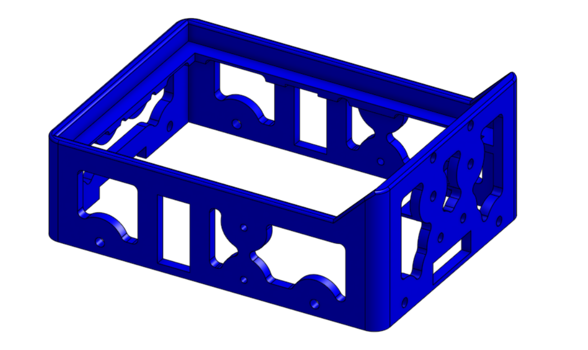
  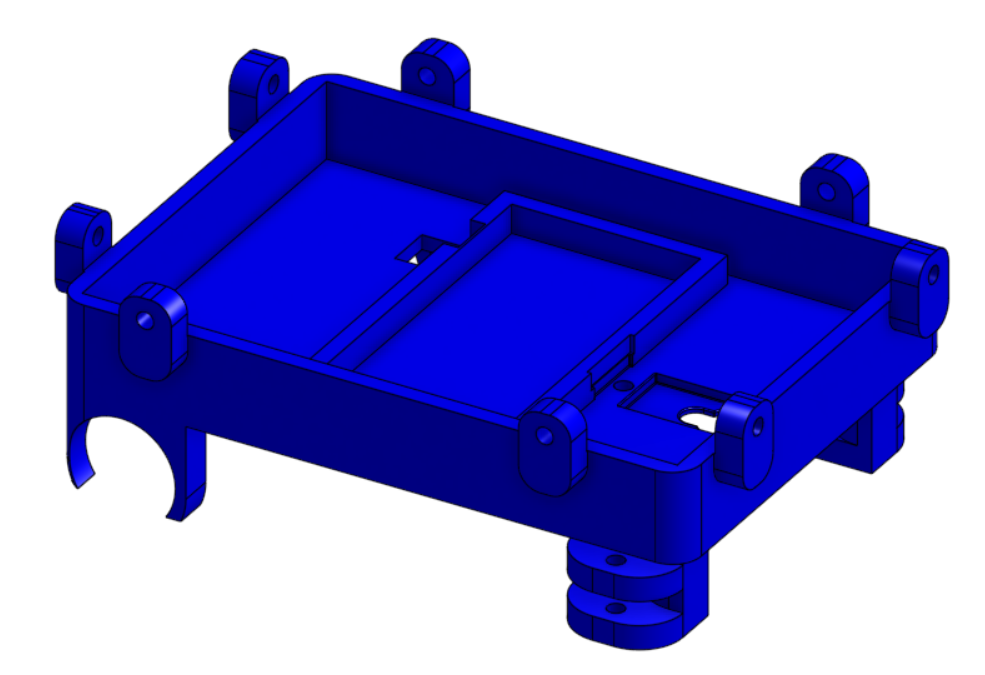
</p>
<p align="center">
  <em>Left: upper section, an open frame with large lateral and end apertures. Right: lower section, a tray with integrated paired lugs at each corner and moulded seats for the drivetrain. The two sections form a closed box when joined.</em>
</p>

### Two part construction

**Requirement:** the structure has to be stiff, but it also has to allow the electronics and drivetrain to be reached without dismantling the vehicle.

**Decision:** the chassis is split into an upper and a lower section, with extensions on the lower part forming the interface to the upper part. The two are joined with **8 M2 screws**.

**Engineering reason:** a single monolithic shell would either enclose the mechanism completely, making it unserviceable, or need large open faces that remove the very material providing the stiffness. Splitting the structure lets each half be a closed perimeter part in its own right, and the screwed joint between them recovers the stiffness at the seam. Eight fasteners distributed around the interface, rather than two or four, spread the clamping load and hold the sections square to each other.

**Implementation:** the lower section is a tray. Its walls and floor carry the drivetrain loads directly, and the paired lugs at each corner form the mounting points for the steering knuckles and the front wheel supports. The upper section is an open frame that carries the electronics deck. Because it does not carry drive or steering loads, its walls can be perforated with the large apertures visible above, removing material while preserving the load paths that matter. This aperture pattern was produced using the Lighten FeatureScript in Onshape, described in the iteration section below.

<p align="center">
  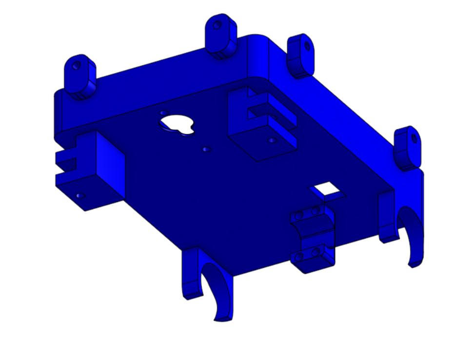
  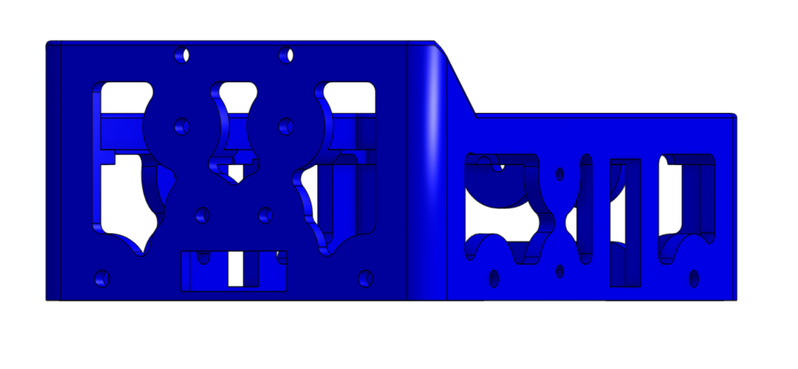
</p>
<p align="center">
  <em>Alternate views of the two sections. The apertures in the upper frame are placed in regions that do not carry drivetrain or steering load; the closed perimeter rails around the top edge are retained to preserve torsional stiffness.</em>
</p>

### Direct component mounting

The camera and the remaining components are mounted directly to the printed structure rather than to intermediate brackets. Each mounting feature is dimensioned in CAD to the component it holds, so the component's own body becomes part of the assembly's dimensional chain.

Every intermediate bracket would add mass, add two more interfaces that can move, and add tolerance stack. For a camera in particular, any compliance between the sensor and the wheels changes the relationship between what the robot sees and where the robot actually is. Mounting the camera to the chassis structure itself keeps that relationship fixed.

### Electronics integration

The upper section provides a flat platform for the PCB and perfboard. Because the electronics sit on the top of the vehicle rather than inside it, wiring, probing and board changes can be done with the vehicle assembled. The deck is the outermost surface, not a buried one.

### Weight distribution

Component positions were adjusted iteratively in CAD until the weight distribution and the component layout were both satisfactory. Because the printed structure is only 71 g, the electronics and battery represent a significant fraction of the total vehicle mass, which makes where they sit a mechanical decision and not just a packaging one.

## Ackermann Steering System

<p align="center">
  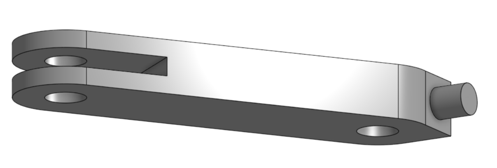
  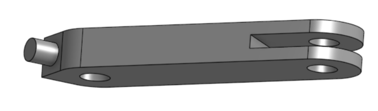
</p>
<p align="center">
  <em>Mirrored left and right steering knuckles. Each has a clevis at the inboard end for the linkage, a stub axle carrying the front wheel bearing, and a through hole for the M2 kingpin screw that pivots it in the chassis lug.</em>
</p>

### The principle

When a vehicle turns, the inner and outer front wheels travel on circles of different radii about the same instantaneous centre. If both wheels are steered to the same angle, at least one of them must point away from the direction it is actually travelling, and the difference is absorbed as **tyre scrub**, where the wheel slides sideways as it rolls.

Ackermann geometry addresses this by steering the inner wheel through a larger angle than the outer wheel, so that a perpendicular drawn from each front wheel meets a perpendicular from the rear axle at a single common centre. Both front wheels then roll along their own true paths instead of being dragged across them. The geometry is realised by angling each steering arm inboard so that the arms project toward the centre of the rear axle, which makes the correct angular relationship an inherent property of the linkage rather than something the control system has to correct for.

### Why Ackermann was selected

**Requirement:** the vehicle must follow a consistent, repeatable path, because the navigation software infers position partly from commanded steering.

**Decision:** Ackermann geometry rather than a parallel or simplified steering arrangement.

**Engineering reason:** reduced tyre scrub during cornering produces smoother turns, better stability and more consistent path tracking. Scrub is not only a friction loss, it is a source of variability, because the amount of sideways slip changes with surface, load and speed. Designing it out makes the relationship between commanded steering angle and actual path more repeatable, which is exactly what an autonomous vehicle depends on.

### Linkage and actuation

<p align="center">
  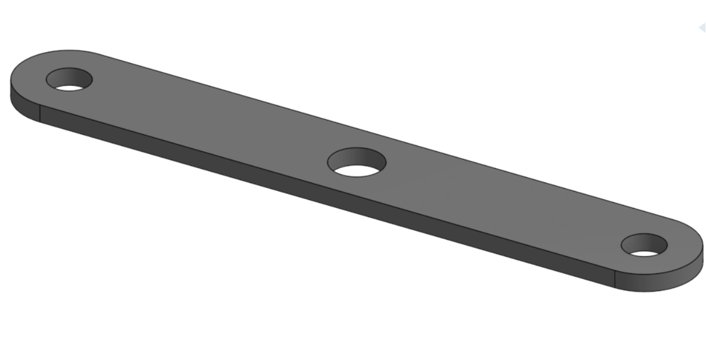
</p>
<p align="center">
  <em>Steering linkage. The two outer holes connect to the clevis on each steering knuckle; the centre hole is driven by the servo, so a single actuator displaces both knuckles simultaneously through the Ackermann geometry.</em>
</p>

The linkage was designed to **minimise mechanical play while remaining easy to assemble, adjust and replace**. Play in a steering linkage is cumulative, since clearance at each joint adds up at the wheel and appears as a dead band in which servo commands produce no wheel movement. Keeping the joint count low and the fits tight is the mechanical countermeasure, and it is why the linkage is a single part driving both knuckles rather than a multi part assembly.

The knuckles pivot on **M2 screws** acting as kingpins in the paired chassis lugs. Using a screw rather than a printed pin means the pivot surface is metal, the fit can be adjusted by tightening, and a worn joint can be restored by replacing a fastener rather than reprinting a structural part.

Each front wheel runs on a **684-2RS sealed bearing** on the knuckle stub axle. A sealed ball bearing at the wheel keeps rolling resistance low and, more importantly for steering accuracy, locates the wheel radially with a precision that a printed plain bore would not hold as it wears.

### Actuator selection

Steering is actuated by a single **EMAX ES08MA II metal gear micro servo**, selected for its compact size, low mass, metal gear train, adequate torque and precise positioning. The metal gear train is the decisive point for a steering application: the linkage transmits impact loads back into the actuator whenever a wheel meets an obstruction, and metal gears keep the actuator intact under exactly the condition that would otherwise end a run. Its compact envelope also allows the servo to sit low inside the lower chassis section, which keeps its mass close to the floor of the vehicle.

## Rear Wheel Drive and Spur Gear Transmission

<p align="center">
  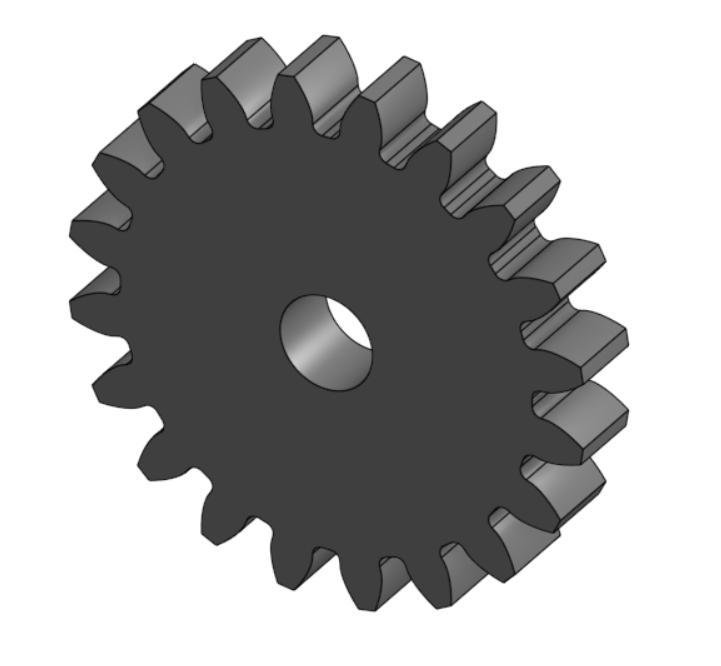
  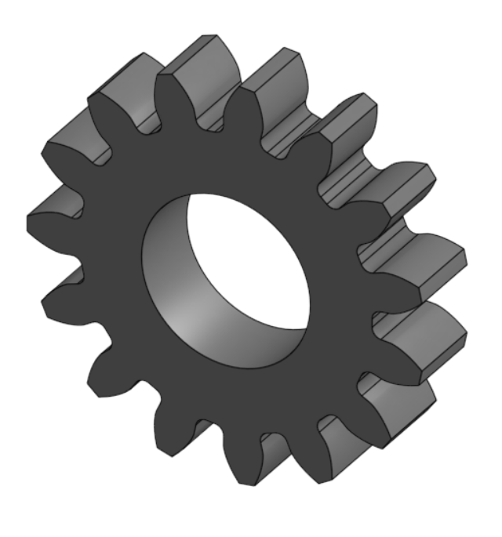
</p>
<p align="center">
  <em>The transmission pair. Left: 20 tooth motor pinion on the N20 D shaft. Right: 15 tooth axle gear with a bore sized to the drive axle. The larger gear drives the smaller, producing a step up in wheel speed.</em>
</p>

### Why rear wheel drive

**Requirement:** a compact drivetrain that does not interfere with the steering mechanism.

**Decision:** rear wheel drive with a single motor on a solid rear axle.

**Engineering reason:** rear wheel drive **separates steering from propulsion**. On a front wheel drive layout, the driven wheels must also pivot, so the drive path has to accommodate a steering angle. That requires either flexible couplings or constant velocity joints, both of which are demanding to produce at this scale by FDM printing and both of which introduce play into the steering. Driving the rear axle lets the drive path be a single straight shaft and lets the front axle be a pure steering mechanism. Each subsystem then does one job, which is what makes both of them simple enough to print reliably.

### Drive path

<p align="center">
  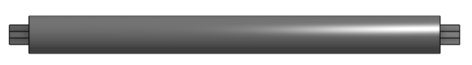
  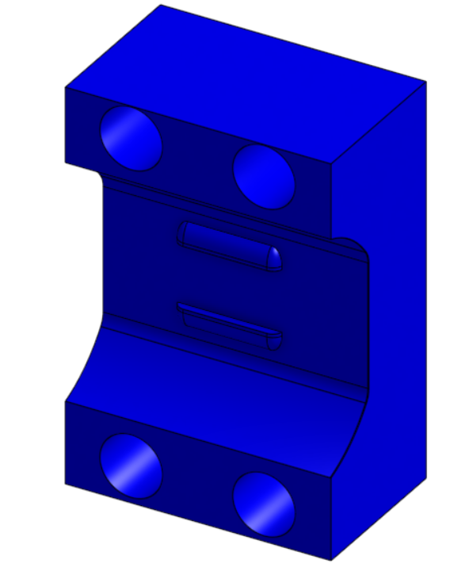
</p>
<p align="center">
  <em>Left: rear drive axle, with cross profile ends that engage the wheel rims and transmit torque by positive form lock rather than friction. Right: motor mount, which fixes the N20 body to the chassis and sets the centre distance between the motor pinion and the axle gear.</em>
</p>

Power flows from the motor to the 20 T pinion, into the 15 T axle gear, along the rear axle, through the rim and into the LEGO wheel.

<p align="center">
  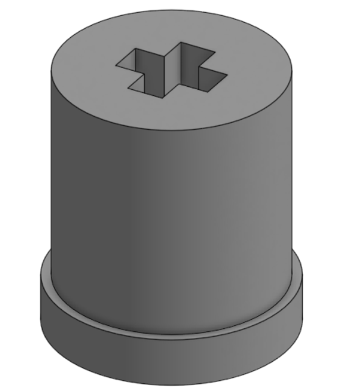
  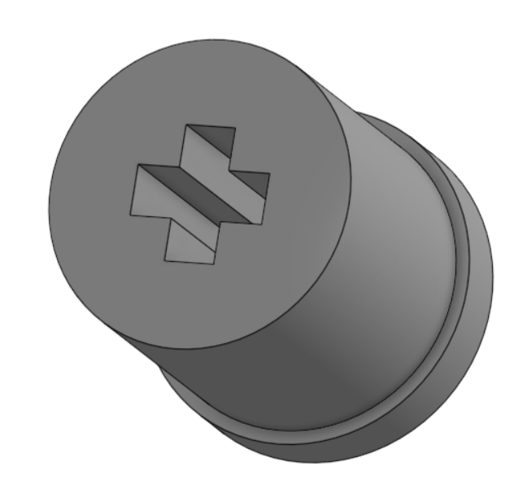
</p>
<p align="center">
  <em>Rear wheel rim. The cross shaped socket mates with the axle end, so drive torque is carried by the profile itself rather than by a friction fit.</em>
</p>

The axle is supported by **two 626-2RS sealed bearings** in the lower chassis section. Two widely spaced bearings, rather than a single bearing or a pair of printed plain bores, constrain the axle in two planes and hold it square under the side load that the gear mesh applies. This keeps the gear centre distance constant while the drive is loaded, which is what keeps the mesh consistent.

The motor mount is the part that establishes the **centre distance between the two gears**. This is the most sensitive dimension in the transmission, since too close and the teeth bind, too far and the mesh loses contact ratio. Making the mount a discrete part rather than a feature of the chassis means this dimension can be adjusted and reprinted at a cost of 1.19 g, without touching the 38.9 g chassis.

### Why spur gears

**Decision:** a plain spur gear pair, chosen over helical and double helical alternatives that were also modelled during development.

**Engineering reason:** a spur pair transmits torque between parallel shafts with no axial thrust component. Helical teeth generate an axial force that must be reacted somewhere, and in a design where the axle is located by two bearings and everything else is printed plastic, that means designing for an additional load path. The spur pair also puts the entire tooth profile in a single print layer plane, which is the geometry FDM reproduces most faithfully at this tooth size.

Using a discrete gear pair rather than a fixed reduction also means **the ratio itself is a design variable**. Changing the drive characteristics costs one reprint of a 0.6 g and a 0.3 g part, which is what made it practical to evaluate several tooth combinations during development.

## Transmission and Speed Analysis

### Transmission ratio

The 20 tooth pinion on the motor drives the 15 tooth gear on the axle. The larger gear drives the smaller, so this is a **step up**:

```
i = N_driver / N_driven = 20 / 15 = 1.333   (4:3)
```

### Wheel speed

```
n_wheel = n_motor × i
        = 500 RPM × 1.333
        = 666.7 RPM
```

### Linear speed

With LEGO 87697 wheels of 21 mm outer diameter:

```
C = π × D = π × 0.021 m = 0.0660 m per wheel revolution

v = C × (n_wheel / 60)
  = 0.0660 × (666.7 / 60)
  = 0.73 m/s
```

This is a **theoretical figure**, calculated from the motor's rated output speed, the gear tooth counts and the wheel diameter.

### Encoder feedback

The N20 unit includes a quadrature encoder rated at 3 pulses per revolution. Because the encoder reads at the motor and the wheel is coupled through a fixed 4:3 ratio and a positive form lock at the rim, motor rotation maps deterministically to wheel rotation. There is no belt or friction coupling anywhere in the path that could slip and break that relationship, and this determinism is a mechanical property of the drivetrain that the control system relies on.

## Mechanical Stability and Rigidity

Rigidity is pursued here for a specific reason: every millimetre of unwanted movement in the structure would become an error in the steering and vision systems. The measures below are the ones taken to prevent it.

| Measure | Mechanical effect |
|---|---|
| 3 mm walls on both chassis sections | Bending stiffness of a wall in this configuration rises steeply with thickness. 3 mm holds the structure well clear of being the compliant element in the assembly. |
| Closed box two part architecture | Joining an open tray to an open frame produces a closed section, which is far stiffer in torsion than either half alone. Torsional stiffness is what keeps all four wheels loaded on an uneven surface. |
| 8 M2 screws at the chassis interface | Distributed clamping holds the two halves square to each other and turns the seam into a load carrying joint. |
| Two 626-2RS bearings on the rear axle | Constrain the axle against the side load from the gear mesh, holding the gear centre distance constant under drive load. |
| 684-2RS bearings at the front wheels | Locate each front wheel radially with a precision that is maintained over the life of the assembly. |
| M2 screws as steering kingpins | Metal pivot surfaces, adjustable by tightening, replaceable without reprinting structure. |
| Direct component mounting | Removes intermediate brackets along with the tolerance stack and compliance each one would add. |
| Low structural mass | Lower mass means lower inertial loads into every joint during acceleration, braking and cornering. Rigidity and lightness reinforce each other in this design rather than competing. |
| Apertures placed off the load paths | Material is removed from the upper frame, which carries no drivetrain or steering load, and retained in the lower tray, which carries both. The lightening pattern leaves the closed perimeter rails intact so the frame retains its torsional stiffness. |

## Design Iteration

The design reached its current form through a series of alternatives that were modelled, evaluated and refined in CAD. The table records what was tried and what was adopted.

| # | Subsystem | Alternatives evaluated | Outcome |
|---|---|---|---|
| 1 | Transmission ratio | Multiple tooth count combinations modelled | 20 T motor and 15 T axle (4:3) adopted |
| 2 | Gear type | Helical and double helical gears modelled | Plain spur gear pair adopted |
| 3 | Wall thickness | 4 mm walls | Refined to 3 mm |
| 4 | Chassis architecture | Single piece chassis | Split into two sections |
| 5 | Rear drive | Mechanical differential considered | Spur gear drive on a solid axle adopted |
| 6 | Upper section mass | Solid upper frame | Lightened using the Lighten FeatureScript in Onshape |
| 7 | Component layout | Multiple component positions | Final layout fixed once weight distribution and packaging were satisfactory |

### Notes on the significant decisions

**Transmission ratio.** Several tooth count combinations were modelled before the 20 T and 15 T pair was adopted. Because both gears are small printed parts, evaluating a ratio was inexpensive, which allowed the choice to be made by comparison across options rather than by picking one at the outset.

**Gear type.** Helical and double helical gearing offers smoother engagement and higher contact ratio in conventional machine design, and both forms were modelled before the plain spur pair was adopted. The mechanical properties that favour a spur pair in this application, namely the absence of axial thrust to react into printed structure and a tooth profile that lies in the print plane, are set out in the transmission section above.

**Wall thickness.** The chassis was first modelled with 4 mm walls and refined to 3 mm. The chassis sections dominate the structural mass at 64.9 g of the 71 g total, so wall thickness is the single largest lever on vehicle mass, acting on the two largest parts in the vehicle. The 3 mm result retains the stiffness the structure needs while removing mass where there was most of it to remove.

**Chassis architecture.** The chassis began as a single piece and was split into upper and lower sections after design trade off analysis. The resulting architecture is what provides the serviceability and electronics access described earlier, and the screwed interface between the halves is what preserves rigidity across the split.

**Rear drive.** A mechanical differential was considered for the rear axle, and the spur gear drive on a solid axle was adopted instead. The consequence is accepted knowingly: with a solid axle, both rear wheels turn at the same speed, so during a turn the rear wheels share a single rotational speed between them. At 71 g the resulting forces are small, while a printed differential would have added several additional gears, bearing surfaces and a housing to the one subsystem that transmits continuous load. Part count and reliability were traded against differential action, and reduced tyre scrub is delivered at the front axle by the Ackermann geometry, where the steering angles make it matter most.

**Upper section lightening.** The upper section was lightened using the **Lighten FeatureScript in Onshape**, which generates a lightening pattern through the part rather than requiring each pocket to be sketched individually. Applying it to the upper frame removed mass from the section that carries no drivetrain or steering load, while leaving the closed perimeter rails and the surrounding material that provide the frame's stiffness. This is the origin of the aperture pattern visible in the upper section renders, and it is why the upper frame can be lightened aggressively without weakening the structure.

**Component layout.** Component positions were moved repeatedly through CAD iterations until both the weight distribution and the component packaging were satisfactory. Because the chassis holds every component directly, moving a component means moving its mounting features, so layout and structure were refined together rather than in sequence.

## CAD and Manufacturing Workflow

All parts were designed in **Onshape**, a browser based parametric CAD platform. The practical advantages for a student team are that the model is version controlled and accessible to every member without local installation or file synchronisation, which matters when several people iterate on interlocking parts.

Because Onshape is parametric, the dimensional interfaces that hold the design together, including the gear centre distance in the motor mount, the bearing seats, the kingpin lug spacing and the screw pattern between the two chassis halves, are defined as driven dimensions rather than sketched by eye. Changing one propagates through the affected geometry, which is what made the iteration described above practical to carry out.

```
Onshape  →  CAD Design  →  Manufacturing Preparation  →  Bambu Studio  →  3D Printing  →  Assembly  →  Testing
```

| Stage | Tool or method |
|---|---|
| CAD design | Onshape |
| Manufacturing preparation | Part orientation and print arrangement |
| Slicing | Bambu Studio |
| Printing | Bambu Lab A1 |
| Assembly | M2 screws, with nuts where required |

### Material selection

**PLA** is used for the main structure. For a vehicle of this mass the loads in the chassis are low, and PLA offers the highest stiffness of the common FDM materials along with excellent dimensional accuracy, which is the property that actually governs this design: the bearing seats, gear bores and screw interfaces all depend on printed dimensions landing within tolerance. A tougher but less dimensionally stable material would trade away the precision the mechanism relies on in exchange for impact resistance that a 71 g vehicle does not call for.

The **wheels are LEGO 87697** at 21 mm diameter by 12 mm wide. Injection moulded rubber tyres offer consistent, repeatable traction and dimensional uniformity between units, and using a standard component means a worn wheel is replaced identically. The printed rim is the adapter between that standard component and our axle.

Print settings for the top part use the **Bambu Studio default profile**.

## Why 3MF

Manufacturing files in this folder are supplied in **3MF** rather than STL or vendor G code.

* **Broad compatibility.** 3MF is an open format read by all major slicers, so the files are not tied to one toolchain the way a printer specific G code file would be.
* **Print information is preserved.** Unlike STL, which carries only triangle geometry, a 3MF retains the print configuration alongside the model.
* **Orientation and arrangement are preserved.** The way each part is positioned and rotated on the build plate is carried in the file. Orientation is a genuine engineering decision on these parts, since it determines the direction of the layer lines relative to the loads and to the printed bores, so preserving it preserves part of the design intent.
* **Manufacturing settings are supported.** Per object settings and modifications survive the transfer rather than needing to be reapplied by hand.
* **Reproducibility.** Another team opening these files starts from our configuration rather than reconstructing it.
* **Simpler handoff into the slicing workflow.** The file opens directly into a prepared plate.

3MF does not guarantee identical output on every printer. Nozzle diameter, extrusion system, motion characteristics, calibration state and filament all vary between machines, and printer specific settings may need adjustment. What 3MF preserves is our configuration and intent as the starting point.

We publish 3MF deliberately rather than native CAD source. The intent is that another team can **manufacture this robot exactly as we designed it**, while the design itself remains our own work.

## Complete Manufacturing File Repository

Every custom manufactured part in the vehicle is listed below. All files are 3MF, produced from Onshape models and prepared in Bambu Studio. Quantities are for one complete vehicle, and additional copies are produced as spares.

| Component | Manufacturing file | Format | Qty | Material | Description | Preview |
|---|---|---|---|---|---|---|
| **Bottom chassis section** | [`Bottom part.3mf`](./Bottom%20part.3mf) | 3MF | 1 | PLA | Primary load carrying structure. Tray form with 3 mm walls, integrated steering lugs at each corner and seats for the drivetrain. 38.9 g. |  |
| **Top chassis section** | [`Top Part.3mf`](./Top%20Part.3mf) | 3MF | 1 | PLA | Upper frame carrying the PCB and perfboard deck. Apertures placed off the primary load paths. 26 g. |  |
| **Drive axle** | [`Axle.3mf`](./Axle.3mf) | 3MF | 1 | PLA | Rear axle running in two 626-2RS bearings. Cross profile ends form lock into the wheel rims. 2.30 g. |  |
| **Axle gear (15 T)** | [`Axle gear.3mf`](./Axle%20gear.3mf) | 3MF | 1 | PLA | Driven gear of the transmission pair. 0.30 g. |  |
| **Motor gear (20 T)** | [`Motor Gear.3mf`](./Motor%20Gear.3mf) | 3MF | 1 | PLA | Driving pinion on the N20 D shaft. 0.60 g. |  |
| **Motor mount** | [`Motor mount.3mf`](./Motor%20mount.3mf) | 3MF | 1 | PLA | Fixes the N20 to the chassis and sets the gear centre distance. 1.19 g. | 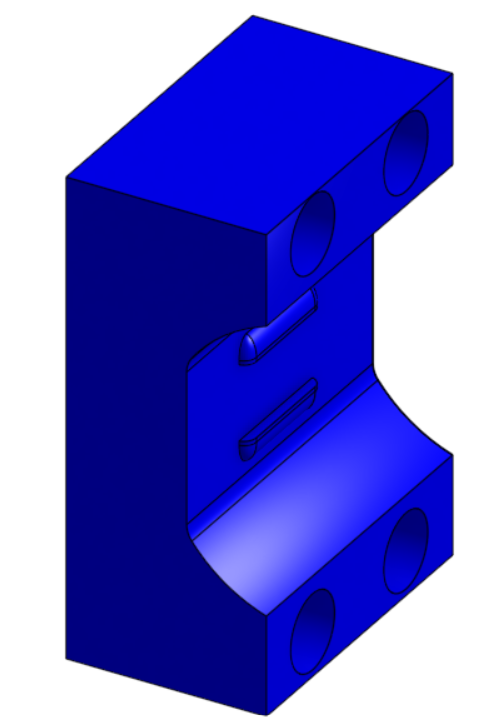 |
| **Rear wheel rim** | [`Rear wheel rim.3mf`](./Rear%20wheel%20rim.3mf) | 3MF | 2 | PLA | Adapter between the cross profile axle end and the LEGO 87697 wheel. 0.70 g each. |  |
| **Steering arm, left** | [`steering_arm_left.3mf`](./steering_arm_left.3mf) | 3MF | 1 | PLA | Left steering knuckle. Clevis for the linkage, stub axle for the 684-2RS bearing, M2 kingpin bore. 0.80 g. | 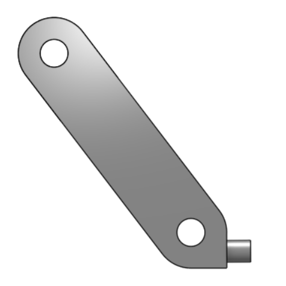 |
| **Steering arm, right** | [`steering_arm_right.3mf`](./steering_arm_right.3mf) | 3MF | 1 | PLA | Mirrored right steering knuckle. 0.80 g. | 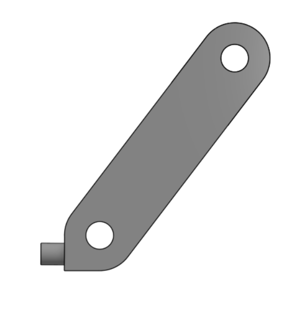 |
| **Steering linkage** | [`steering_linkage.3mf`](./steering_linkage.3mf) | 3MF | 1 | PLA | Outer holes connect to the knuckle clevises, centre hole driven by the servo. 0.63 g. | 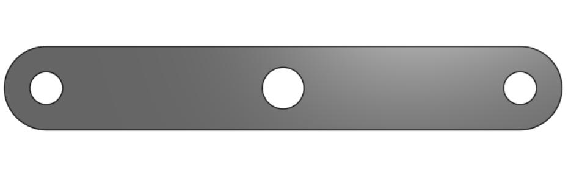 |

## Engineering Approach

### 1. Conceptual design and requirements analysis

The five objectives set out in the design philosophy were fixed first, and the architecture was chosen against them: Ackermann steering for path repeatability, rear wheel drive to keep the drive path straight and independent of the steering, and a size target that drove the 121 by 83 by 83 mm envelope. Fixing the envelope early is what made the later packaging decisions genuine constraints rather than afterthoughts, and the 67 mm wheelbase and 85 mm track follow from it.

### 2. Precision CAD modelling

All parts were modelled parametrically in Onshape with the mechanical interfaces defined as driven dimensions: gear centre distance, bearing seats, kingpin spacing, screw pattern and component mounting features. Modelling the complete assembly rather than individual parts is what allowed interference and packaging to be resolved before material was committed.

### 3. Prototyping and optimisation

The iterations documented above were carried out at this stage: multiple gear tooth combinations, helical and double helical gear forms, the refinement from 4 mm to 3 mm walls, the split of the chassis into two sections, the selection of the spur gear drive over a differential, the lightening of the upper section using the Lighten FeatureScript in Onshape, and repeated repositioning of components for weight distribution and packaging.

### 4. Production engineering and system validation

Final parts were prepared in Bambu Studio, printed in PLA on the Bambu Lab A1, and assembled with M2 fasteners into the vehicle documented here.

## Validation

Design validation was carried out at two levels.

**In CAD.** The complete assembly was modelled and checked as an assembly, so that packaging, interference and the fit between mating features were resolved before printing. The alternatives recorded in the iteration table were each evaluated in this environment, which is what allowed several gear ratios and gear forms to be compared against one another rather than committing to a single option.

**In hardware.** The manufacturing files in this folder were printed and assembled into the complete vehicle. This confirms that the dimensional interfaces designed in CAD, including the bearing seats, the gear centre distance set by the motor mount, the cross profile between axle and rim, the kingpin lugs and the 8 screw chassis interface, transfer correctly from the model to printed parts and function together as an assembled mechanism.

The speed and ratio figures in the transmission and speed analysis are calculated values, derived from the published motor specification, the gear tooth counts and the wheel diameter, and they are identified as theoretical at the point of use.

## Engineering Summary

| Decision | Justification |
|---|---|
| Compact, lightweight architecture | Lower inertia to accelerate and decelerate, lower load on every printed joint, and less structure needed to achieve a given stiffness. |
| Ackermann steering | Reduces tyre scrub, which improves both efficiency and the repeatability of the relationship between commanded steering and actual path. |
| Rear wheel drive | Separates steering from propulsion and keeps the drive path a straight shaft with no joint that must accommodate a steering angle. |
| Spur gear pair | No axial thrust to react into printed structure, tooth profile lies in the print plane, and the ratio remains an inexpensive design variable. |
| 4:3 step up, 20 T to 15 T | Raises wheel speed above motor output speed, which is the useful direction on a light vehicle running on a flat surface where lap time is the constraint. |
| Two part chassis | Closed box when joined for torsional stiffness, open for assembly and service. The screwed interface preserves rigidity across the split. |
| 8 M2 screws at the interface | Distributed clamping makes the seam a load carrying joint and holds the two halves square. |
| 3 mm walls, both sections | Refined from 4 mm, acting on the two parts that dominate structural mass. |
| Lighten FeatureScript on the upper section | Removes mass from the frame that carries no drivetrain or steering load, while the closed perimeter rails preserve its stiffness. |
| Solid rear axle | Lower part count and a simpler continuously loaded subsystem, with front axle scrub addressed by the Ackermann geometry where the steering angles make it matter most. |
| Sealed bearings throughout | Hold the gear centre distance under load and locate the wheels precisely over the life of the assembly. |
| M2 screws as kingpins | Metal pivot surfaces, adjustable and replaceable without reprinting structural parts. |
| Direct component mounting | Removes brackets, tolerance stack and compliance between the camera and the wheels. |
| PLA structure | Highest stiffness and excellent dimensional accuracy among the common FDM materials, which is the property this mechanism depends on. |
| LEGO 87697 wheels | Consistent, repeatable traction and dimensional uniformity between units. |
| Onshape | Parametric interfaces propagate through the assembly, with browser based access for the whole team. |
| 3MF files | Preserves print configuration and orientation for reproducible manufacture without releasing the source design. |

*Team MadEngineerz — WRO 2026 Future Engineers*
