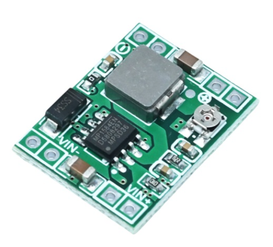
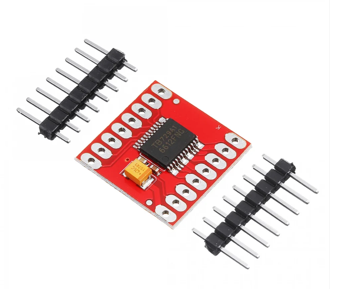

# Other Resources

Supplementary material for Team MadEngineerz, WRO 2026 Future Engineers. This folder holds component references and the research documents that informed the robot's design.

## Electronic Components

| Component | Image | Description |
|---|---|---|
| **Raspberry Pi Zero 2 W** |  | Main compute board. Runs the vision pipeline and navigation. |
| **Raspberry Pi Camera** |  | Primary navigation sensor. Used for obstacle detection and colour identification. |
| **VL53L1X ToF** |  | Time of flight distance sensor. |
| **VL53L3CX ToF** |  | Time of flight distance sensor. |
| **Arduino Nano** |  | Secondary microcontroller. |
| **360 mAh 7.4 V 2S 30C LiPo** |  | Main battery pack. |
| **MP1584** |  | Step down voltage regulator module. |
| **EMAX ES08MA II** |  | Metal gear micro servo. Actuates the Ackermann steering linkage. |
| **500 RPM N20** |  | 6 V metal gear motor with encoder. Drives the rear axle. |
| **LSM6DSOX IMU** |  | Inertial measurement unit. Supports parking guidance and path mapping. |
| **TCA9548A** |  | I2C multiplexer for running multiple I2C devices on one bus. |
| **TB6612FNG** |  | Motor driver. |

## Research & Design

| Resource | Document | Description |
|---|---|---|
| **Design ideology** | [`Ideology..pdf`](./Ideology..pdf) | The three principles the robot is built on: small, efficient, simplistic. Sets the target total mass of roughly 100 to 200 g, minimal battery capacity, a compact chassis, lightweight maintainable software and simplified CAD. |
| **Steering research** | [`Hardware..pdf`](./Hardware..pdf) | Ackermann steering selection, the reasoning behind reduced tyre scrub and more consistent path tracking, and the choice of the EMAX ES08MA II as the steering actuator. |
| **Propulsion research** | [`Hardware..pdf`](./Hardware..pdf) | Rear wheel drive layout with a single N20 motor, and the evaluation of three transmission options: spur gear drive, timing belt drive and rear differential drive, with the advantages and disadvantages of each. |
| **Battery placement and weight distribution** | [`Battery plan.pdf`](./Battery%20plan.pdf) | Battery specification and its position above the drivetrain, and the relationship between rear axle loading and the authority of the Ackermann steering system. |
| **Code architecture research** | [`Code Architecture..pdf`](./Code%20Architecture..pdf) | Sensor reliance split for the Obstacle Challenge, the two core software structure covering vision and navigation, the Pure Pursuit approach to steering, and the preliminary parking sequence. Also covers the simpler Open Challenge strategy. |

## Technical Documentation

| Area | Documentation |
|---|---|
| Mechanical design and manufacturing files | [Models](../models/README.md) |
| Electrical design and schematics | [Schemes](../schemes/README.md) |
| Software implementation | [Source](../src/README.md) |

*Team MadEngineerz, WRO 2026 Future Engineers*
