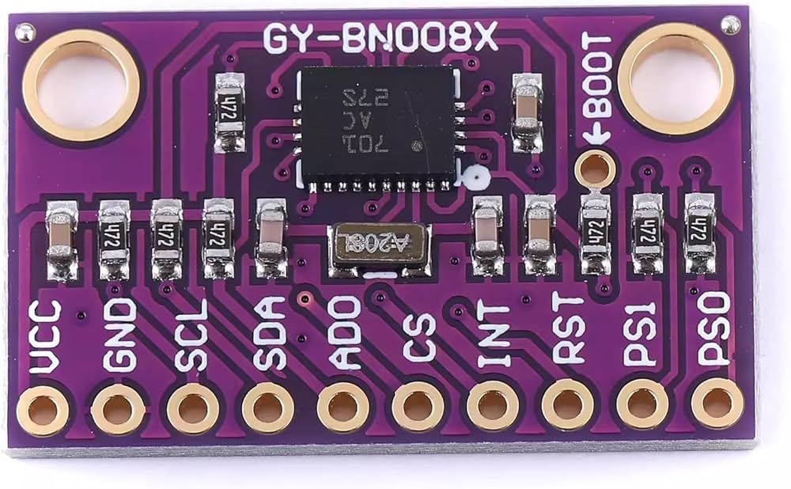
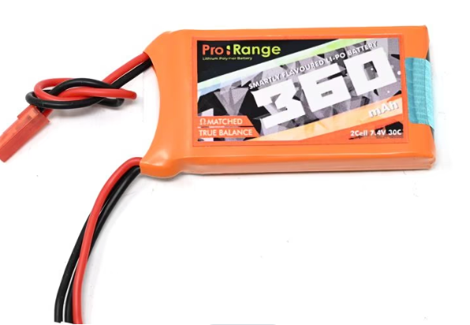
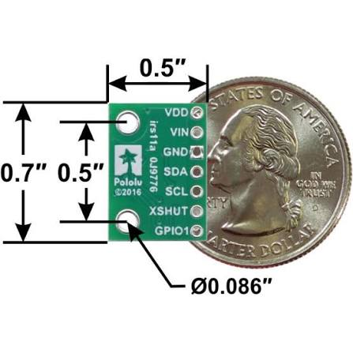
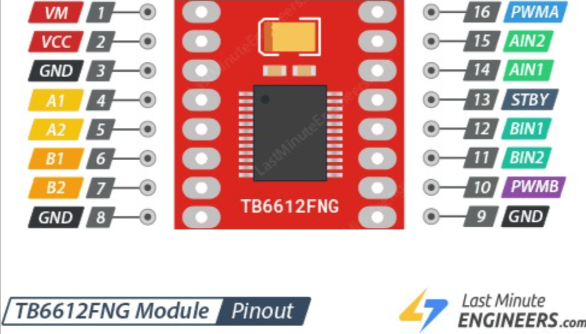

# Schemes Documentation

Complete electrical documentation for the MadEngineerz WRO 2026 Future Engineers robot. This folder holds the wiring schematic, the power system analysis, the electrical design philosophy, and the pinouts, reference schematics, component images and manufacturer datasheets for every electronic part in the vehicle.

## Contents

* Electrical Design Philosophy
* Complete Bill of Materials
* Complete Wiring System
* Power Management System
* Cable Management
* Custom Perfboard-Based Electronics
* Component-Specific Engineering
* Time-of-Flight Sensor System
* Motor System
* TB6612FNG Motor Driver
* EMAX ES08MA II Steering Servo
* BNO085 IMU
* MP1584 Voltage Regulator
* TCA9548A I²C Multiplexer
* Pinout and Schematic Reference
* Datasheets
* Electrical Documentation Repository
* Technical Documentation

## Electrical Design Philosophy

Full document: [`Electrical_design_Philosophy.pdf`](./Electrical_design_Philosophy.pdf)

### 1. Power architecture and battery selection

**Cell chemistry.** A Lithium Polymer pack was selected to optimise the vehicle's power to weight ratio. LiPo provides the high discharge rate needed to absorb rapid motor acceleration without voltage drops, in a compact physical volume that suits the tight chassis constraints.

**Thermal and electrical efficiency.** Logic and sensing units are supplied through a high efficiency switching buck converter rather than a linear regulator such as an LM7805. Switching regulation significantly reduces thermal dissipation and avoids wasting energy as heat, which extends battery operational life across testing and competition runs.

**Driver architecture.** A compact H-bridge driver was chosen in preference to a full motor shield. This reduced the board footprint and simplified wire routing, and the body diodes inside the H-bridge handle inductive kickback from the motor, removing the need for external flyback diodes.

### 2. Noise isolation and topology

**Inherent power isolation.** The architectural layout naturally separates clean logic lines from high noise inductive loads. The high noise components, meaning the motor and the driver, draw directly from the LiPo pack or from dedicated buck converter lines rather than sharing a path with the logic supply.

**Signal protection.** With the high current paths isolated from the central logic, the low voltage control signals stay protected from electromagnetic interference and ground bounce. This matters specifically for the PWM motor drive commands and the high frequency rotary encoder pulses, both of which are corrupted by exactly the kind of noise a motor generates.

### 3. Sensor fusion and odometry strategy

A complementary sensor suite was implemented to eliminate visual blind spots and maintain position tracking.

```
                    +---------------------------+
                    |    Primary Visual Feed    |
                    |      (RPi + Camera)       |
                    +-------------+-------------+
                                  |
                +-----------------+-----------------+
                |                                   |
                v                                   v
   +---------------------------+       +---------------------------+
   |   Blind Spot Clearance    |       |   Vehicle State & Pos.    |
   |  (Time-of-Flight Arrays)  |       |  (IMU + Rotary Encoder)   |
   +---------------------------+       +---------------------------+
```

**Visual perception with proximity sensing.** The camera provides long range track layout recognition but suffers localised blind spots directly around the vehicle bumpers. Time-of-Flight distance sensors are paired with it to cover those blind spots and to provide accurate distance to wall measurements.

**Odometry and dead reckoning.** To compensate for momentary visual occlusion or lighting variation, the IMU supplies heading and angular velocity while the rotary encoder supplies wheel rotation and linear distance. Both run continuously, giving a steady multi sensor estimate of vehicle state that does not depend on the camera being usable at that instant.

### 4. Communication and serviceability

**Processing bus.** UART was selected for inter board communication between the main vision processor and the low level real time controller. UART is a lightweight point to point serial connection that avoids the master and slave overhead, the addressing and the driver complexity that I²C or SPI would bring to a link with only two endpoints.

**Modular cabling.** All sensors, power rails and actuators use polarised JST connectors. This modularity allows a component to be swapped instantly during troubleshooting in pit conditions, without any re-soldering.

### 5. Accessible compute bus and wiring

All compute components, meaning the Raspberry Pi Zero and the Arduino Nano, along with the multiplexer and the IMU, are placed at the top of the vehicle in a detachable manner. This gives direct access for debugging, wiring, last minute changes and flashing code. The wiring and these components are carried on a perfboard.

## Complete Bill of Materials

| Component | Image | Quantity | Description |
|---|---|---:|---|
| **Raspberry Pi Zero 2 W** |  | 1 | Main vision processor. Hosts the camera and the I²C bus, and links to the Arduino Nano over UART. |
| **Raspberry Pi Camera** |  | 1 | Primary visual sensor for long range track layout recognition. Connects to the Pi over the camera ribbon cable. |
| **Arduino Nano** |  | 1 | Low level real time controller. Drives the motor driver inputs and handles the encoder pulses. |
| **VL53L1X** |  | 1 | Time-of-Flight ranging sensor, up to 400 cm, typical full field of view 27°. |
| **VL53L3CX** |  | 3 | Time-of-Flight ranging sensor with multi target detection, typical full field of view 25°. |
| **BNO085** |  | 1 | 9 DoF orientation IMU with on board sensor fusion. Supplies heading and angular velocity. |
| **TCA9548A** |  | 1 | 8 channel I²C multiplexer. Gives each ranging sensor its own bus channel. |
| **TB6612FNG** |  | 1 | H-bridge motor driver for the N20 drive motor. |
| **MP1584** |  | 1 | Step down switching buck converter producing the regulated logic rail. |
| **500 RPM N20 motor** |  | 1 | Metal gear DC motor with rotary encoder. Drives the rear axle. |
| **EMAX ES08MA II** |  | 1 | Metal gear micro servo. Steering actuator. |
| **Battery** |  | 1 | 2S LiPo pack. Sole power source for the vehicle. |

Component photographs for the TCA9548A, N20 motor, servo and battery are held in the [`other`](../other/) folder and referenced here rather than duplicated.

## Complete Wiring System

The complete wiring schematic is the source of truth for every electrical connection in the robot.

<p align="center">
  <a href="./WIRING.pdf"><strong>Open the complete wiring schematic &rarr; WIRING.pdf</strong></a>
</p>

### Electrical architecture

**Power input.** The 2S LiPo pack appears in the schematic with its positive terminal and its 0 V return. The pack feeds two things directly: the input side of the MP1584 buck converter, and the motor supply of the TB6612FNG.

**Voltage regulation.** The MP1584 is drawn with `VIN+` and `VIN-` on its input and `Vout+` and `Vout-` on its output. Its regulated output supplies the logic side of the system.

**Raspberry Pi Zero 2 W.** The Pi appears as its `J1` 40 pin GPIO header with the standard pin functions labelled, including the `+3V3` and `+5V` rails, both `GND` pins, `GPIO02/SDA1` and `GPIO03/SCL1` for I²C, `GPIO14/TXD0` and `GPIO15/RXD0` for UART, and the SPI, PWM and PCM capable pins. The header carries the I²C bus out to the multiplexer, and the +3V3 and +5V rails are distributed from it.

**Arduino Nano.** The Nano block shows a micro USB-B port and the `GPIO 5`, `GPIO 6`, `GPIO 8` and `GPIO 10` lines together with `VCC` and `GND`. A **MICROUSB BUS** block with separate `Data` and `PWR` lines sits between the Pi and the Nano, carrying both the serial link and the Nano's supply.

**Motor driver and motor.** The TB6612FNG block carries `VCC`, `GND`, `MOTOR VCC`, the `AIN1` and `AIN2` control inputs and the `AOUT1` and `AOUT2` motor outputs. `MOTOR VCC` comes from the pack side, while `VCC` is the logic supply. `AIN1` and `AIN2` are driven from the Nano's `GPIO 10` and `GPIO 6`. `AOUT1` and `AOUT2` run to the N20's `MOTOR PIN 1` and `MOTOR PIN 2`. The N20 block also carries `VCC` and `GND` for its encoder and the `C1` and `C2` encoder channels, which return to the Nano.

**Steering servo.** The `ES08MA II` block is drawn with three connections: `VCC`, `GND` and `PWM`.

**I²C devices.** The `TCA9548A` block carries `VCC`, `GND`, `SDA`, `SCL` and `RST` on its upstream side, the `A0`, `A1` and `A2` address pins, and the eight downstream channel pairs `SD0`/`SC0` through `SD7`/`SC7`. The ranging sensors are drawn as blocks with `VCC`, `GND`, `SCL` and `SDC`, each connecting to its own multiplexer channel rather than sharing one bus.

**Ground.** Common ground is the negative terminal of the LiPo pack, giving every device on the vehicle a single fixed voltage reference. This is what allows the I²C bus, the servo PWM line and the encoder pulses to be read consistently across devices sitting on different supply rails.

The schematic also carries a reference note pointing to `https://pinout.xyz/` for additional Raspberry Pi pin functions.

## Power Management System

Full document: [`Power System..pdf`](./Power%20System..pdf)

### Power distribution architecture

The distribution is deliberately simple. The 2S LiPo pack supplies the vehicle, and the buck converter together with the single board computer produces the lower rails. There is no further conversion stage.

| Rail | Source | Supplies |
|---|---|---|
| **7.4 V to 8.4 V** | LiPo pack, direct | Motor driver, buck converter input |
| **5 V** | Buck converter and the SBC/SBM | Raspberry Pi and Arduino Nano, sensors, motor driver power, servo motor |
| **3.3 V** | Raspberry Pi, over the camera ribbon cable | Camera. Many components, including all the ToF sensors and the I²C multiplexer, are compatible with both 3.3 V and 5 V |

**Common ground** is the negative terminal of the LiPo pack, providing a common fixed voltage reference for the whole system.

Two consequences follow from this topology. The motor driver is the only device that takes the raw pack voltage, so everything else sits behind the regulator and is insulated from the voltage sag the motor causes when it loads. And because most of the sensing hardware tolerates either 3.3 V or 5 V, the number of distinct rails stays at three rather than requiring separate regulation per sensor family.

### Power consumption analysis

Figures below are worst case estimates for an unideal scenario, taken from the power system document. They are calculated estimates rather than measured values.

| Hardware | Voltage | Current draw |
|---|---|---|
| Raspberry Pi Zero at 100% CPU capacity | 5 V | ~220 mA |
| Camera | 5 V | 200 to 225 mA |
| N20 motor | 7.4 V motor, 3.3 V or 5 V logic | 180 to 550 mA |
| Arduino Nano, UART connection to the Pi | 3.3 V | 30 to 50 mA |
| VL53L1X | 5 V to 3.3 V | 20 mA per sensor |
| VL53L3CX | 3.3 V to 5 V | 20 mA per sensor |
| TB6612FNG driver | 7.4 V for the motor, 5 V logic | 5 mA |
| TCA9548A | 3.3 V to 5 V | ~1 mA, negligible |
| **Total system** | mixed | **796 mA to 1.2 A** |

The dominant and most variable load is the motor, whose draw spans a range roughly three times wider than any other device. Current spikes occur mainly when the N20 is suddenly loaded, which in practice means starting from a standstill or striking an obstacle. Those events are expected to be rare, but the analysis accounts for them rather than assuming a steady load.

## Cable Management

The vehicle has a relatively large open central region between the upper and lower chassis sections. Cable management is built around that space rather than around dedicated routing hardware.

All wiring from the upper portion of the robot and all wiring from the lower portion meets in this central region. Because both halves terminate in the same place, the cabling is a set of short runs into one area instead of long runs across the vehicle, and the result is practical rather than elaborate:

* **Organisation.** Connections converge at one identifiable region, so a wire can be traced from either end without following it around the chassis.
* **Assembly.** The upper and lower sections are wired separately and joined at the centre, which means each half can be built and checked on its own.
* **Accessibility and maintenance.** Separating the two chassis sections exposes the whole cable run at once, so a connection can be reached without dismantling further.
* **Connecting upper and lower electronics.** The perfboard on the upper section is the landing point for the devices mounted below, and the central region is the path between them.
* **Clearance from mechanical systems.** Routing through the central region keeps cabling away from the steering linkage and the rear axle and gear pair, which are the only moving parts that could catch or chafe a wire.
* **Troubleshooting.** Faults are located by inspecting one region rather than the whole vehicle, and the JST connectors described in the design philosophy allow a suspect device to be disconnected there and swapped.

## Custom Perfboard-Based Electronics

The robot uses a **custom perfboard-based electrical system**. The perfboard carries the compute components and the interconnections between every module, and mounts to the upper chassis section as a detachable electronics deck.

This is an intentional engineering choice suited to how the robot was developed, not a claim that perfboard is better in general. A professionally manufactured PCB gives a more finalised and more compact result, and for a settled design it is the better answer. The difference is what happens when the design changes: a PCB change generally requires another board revision and another manufacturing cycle, whereas the perfboard circuit can be modified directly, in place, during development.

| Aspect | Professional PCB | Our perfboard system |
|---|---|---|
| Development | Fixed after manufacturing | Easily modified |
| Modification | Requires a board revision | Direct modification |
| Development cost | Higher for repeated revisions | Low |
| Hands-on experience | Lower | High |
| Component replacement | More difficult | Easier |
| Manufacturing | External fabrication | In-house |
| Flexibility | Lower after fabrication | High |

In practice this gives the project rapid development, low cost across repeated revisions, hands on soldering and circuit building experience for the team, in-house manufacturing with no external dependency, straightforward component replacement and troubleshooting, and modularity that is genuinely practical because a module can be lifted out and tested on its own.

### Device placement

Three devices are mounted on the perfboard itself:

* Raspberry Pi Zero 2 W
* Arduino Nano
* BNO085 IMU

Every other device connects to the perfboard from below, from wherever it is mounted in the chassis. This split follows the design philosophy's requirement that the compute components sit at the top of the vehicle in a detachable manner. The processors, the multiplexer and the IMU have no reason to sit anywhere but the deck, while the camera, the ranging sensors, the motor driver, the motor and the servo must sit where their function places them. Making the perfboard the single upper interconnection point means each distributed device needs one run up to a common landing rather than a web of connections between themselves.

The perfboard is a physical build rather than a drawn artefact, so it does not appear in the digital wiring schematic. It is documented here as the manufacturing approach that implements that schematic.

## Component-Specific Engineering

### Raspberry Pi Zero 2 W

<p align="center">
  
  
</p>
<p align="center">
  <em>Raspberry Pi Zero GPIO pinout and board reference schematic, used to plan the header assignments for the I²C bus, the UART link and the power rails.</em>
</p>

**Role.** Main vision processor. It hosts the camera, drives the I²C bus through the multiplexer, and communicates with the Arduino Nano over UART.

**Header connections as drawn in the wiring schematic.**

| Pin | Function | Connection |
|---|---|---|
| `+3V3` | 3.3 V rail | Distributed from the header |
| `+5V` | 5 V rail | Distributed from the header |
| `GND` (two pins) | Ground | Common ground with the LiPo negative terminal |
| `GPIO02/SDA1` | I²C data | Upstream side of the TCA9548A |
| `GPIO03/SCL1` | I²C clock | Upstream side of the TCA9548A |
| `GPIO14/TXD0` | UART transmit | Serial link to the Arduino Nano |
| `GPIO15/RXD0` | UART receive | Serial link to the Arduino Nano |

The schematic labels the remaining header pins with their standard functions, including the SPI group (`GPIO09/SPI0.MISO`, `GPIO10/SPI0.MOSI`, `GPIO11/SPI0.SCLK`, `GPIO07/SPI0.CE1`, `GPIO08/SPI0.CE0`), the PWM pins (`GPIO12/PWM0`, `GPIO13/PWM1`), the PCM group and the `ID_SDA` and `ID_SCL` pins.

**Datasheet:** [`Raspberry pi 0 datasheet.pdf`](./Raspberry%20pi%200%20datasheet.pdf)

### Raspberry Pi Camera

<p align="center">
  
</p>
<p align="center">
  <em>Camera connector pinout. The camera attaches to the Pi over the ribbon cable, which also carries its 3.3 V supply.</em>
</p>

**Role.** Primary visual sensor. It provides long range recognition of the track layout, while the ToF array covers the blind spots immediately around the vehicle that the camera cannot see.

**Power.** 3.3 V, supplied by the Raspberry Pi over the ribbon cable.

**Datasheets:** [`raspberry-pi-camera datasheet.pdf`](./raspberry-pi-camera%20datasheet.pdf) · [`RP-008969-SD-3-Raspberry Pi Camera Module 3 Reference Schematic.pdf`](./RP-008969-SD-3-Raspberry%20Pi%20Camera%20Module%203%20Reference%20Schematic.pdf)

### Arduino Nano

<p align="center">
  
</p>
<p align="center">
  <em>Arduino Nano, the low level real time controller handling motor drive signals and encoder pulses.</em>
</p>

**Role.** Low level real time controller. UART was chosen for its link to the Pi because a two endpoint connection gains nothing from I²C or SPI addressing and arbitration.

**Connections as drawn in the wiring schematic.**

| Pin | Function | Connection |
|---|---|---|
| `VCC` | Supply | Logic rail |
| `GND` | Ground | Common ground |
| micro USB-B port | Data and power | MICROUSB BUS block, linking to the Raspberry Pi |
| `GPIO 10` | Motor control output | TB6612FNG `AIN1` / `AIN2` |
| `GPIO 6` | Motor control output | TB6612FNG `AIN1` / `AIN2` |
| `GPIO 5` | Control line | Motor and servo control group |
| `GPIO 8` | Control line | Motor and servo control group |

**Datasheets:** [`A000005-datasheet.pdf`](./A000005-datasheet.pdf) · [`A000005-full-pinout.pdf`](./A000005-full-pinout.pdf)

## Time-of-Flight Sensor System

Current configuration: **1 × VL53L1X** and **3 × VL53L3CX**.

<p align="center">
  
  
  
</p>
<p align="center">
  <em>VL53L1X and VL53L3CX ranging sensors, with the VL53L3CX package dimensions that govern how the sensors are mounted in the chassis.</em>
</p>

**Role in the architecture.** The camera handles long range track layout recognition but has localised blind spots directly around the vehicle bumpers. The ToF array covers those blind spots and provides the distance to wall measurements the camera cannot supply. In the navigation software the ToF sensors carry the highest authority when an immediate risk of collision is detected, and they are used for parking, crash prevention and final positioning.

### ToF sensor comparison

Specifications below are taken from the manufacturer datasheets in this folder.

| Characteristic | VL53L1X | VL53L3CX |
|---|---|---|
| Quantity | 1 | 3 |
| Ranging distance | Up to 400 cm | Up to 300 cm+ with full field of view |
| Typical full field of view | 27° | 25° |
| Ranging frequency | Up to 50 Hz | Not stated in the datasheet summary |
| Measurement technology | SPAD receiving array with integrated lens, 940 nm Class 1 laser | Histogram based direct ToF, 940 nm VCSEL |
| Distinguishing features | Programmable region of interest, both size and position, allowing the field of view to be reduced and multizone operation controlled from the host | Multi target detection and measurement, short distance high accuracy linearity, immunity to cover glass crosstalk and fingerprint smudge at long distance, dynamic smudge compensation |
| Interface | I²C | I²C up to 1 MHz, with Xshutdown and interrupt GPIO |
| Package size | 4.9 × 2.5 × 1.56 mm | 4.4 × 2.4 × 1.0 mm |
| Supply compatibility | 3.3 V and 5 V | 3.3 V and 5 V |

**Bus architecture.** Both parts are I²C devices, and identical ranging sensors cannot share a single bus without address management. Every sensor is therefore given its own downstream channel on the TCA9548A, as drawn in the wiring schematic, with `VCC`, `GND`, `SCL` and `SDC` on each block.

**Datasheets:** [`VL53L1X.pdf`](./VL53L1X.pdf) · [`VL53L3CX.PDF`](./VL53L3CX.PDF) · [`VL53LX-Distance-Sensor-Schematic.pdf`](./VL53LX-Distance-Sensor-Schematic.pdf)

## Motor System

<p align="center">
  
</p>
<p align="center">
  <em>N20 motor and Hall effect encoder pinout, covering both the motor terminals and the encoder outputs.</em>
</p>

**Role.** Single drive motor for the rear axle. The mechanical drivetrain, gear ratio and speed analysis are documented in the [Models](../models/README.md) documentation; this section covers the electrical integration only.

**Power.** 7.4 V for the motor, with 3.3 V or 5 V logic for the encoder. Estimated draw is 180 to 550 mA, the widest range of any device in the system.

**Connections as drawn in the wiring schematic.**

| Pin | Function | Connection |
|---|---|---|
| `MOTOR PIN 1` | Motor terminal | TB6612FNG `AOUT1` |
| `MOTOR PIN 2` | Motor terminal | TB6612FNG `AOUT2` |
| `VCC` | Encoder supply | Logic rail |
| `GND` | Encoder ground | Common ground |
| `C1` | Encoder channel | Returned to the Arduino Nano |
| `C2` | Encoder channel | Returned to the Arduino Nano |

**Why the encoder path is isolated.** The design philosophy separates the high current motor path from the logic side precisely so that the high frequency encoder pulses on `C1` and `C2` are not corrupted by the motor's own switching noise or by ground bounce. The encoder is the vehicle's source of wheel rotation and linear distance for dead reckoning, so a corrupted pulse train degrades position tracking directly.

## TB6612FNG Motor Driver

<p align="center">
  
  
</p>
<p align="center">
  <em>TB6612FNG motor driver module and its reference documentation.</em>
</p>

**Role.** H-bridge driver between the low level controller and the N20 motor. A compact driver was chosen in preference to a full motor shield to reduce footprint and simplify routing, and its internal body diodes absorb the inductive kickback from the motor, so no external flyback diodes are required.

**Connections as drawn in the wiring schematic.**

| Pin | Function | Connection |
|---|---|---|
| `MOTOR VCC` | Motor supply | LiPo pack, 7.4 V to 8.4 V |
| `VCC` | Logic supply | 5 V rail |
| `GND` | Ground | Common ground |
| `AIN1` | Control input | Arduino Nano, `GPIO 10` / `GPIO 6` |
| `AIN2` | Control input | Arduino Nano, `GPIO 10` / `GPIO 6` |
| `AOUT1` | Motor output | N20 `MOTOR PIN 1` |
| `AOUT2` | Motor output | N20 `MOTOR PIN 2` |

**Power architecture.** The separation of `MOTOR VCC` from `VCC` is what makes the isolation described in the design philosophy work: the motor current is drawn from the pack while the driver's logic side sits on the regulated rail with the rest of the control electronics.

**Estimated logic draw:** 5 mA.

**Datasheet:** [`TB6612FNG_datasheet_en_20121101.pdf`](./TB6612FNG_datasheet_en_20121101.pdf)

## EMAX ES08MA II Steering Servo

<p align="center">
  
  
</p>
<p align="center">
  <em>EMAX ES08MA II metal gear micro servo and its reference details.</em>
</p>

**Role.** Steering actuator. It drives the steering linkage, whose Ackermann geometry is documented in the [Models](../models/README.md) documentation. This section covers the electrical integration only.

**Power.** 5 V rail.

**Connections as drawn in the wiring schematic.**

| Pin | Function | Connection |
|---|---|---|
| `VCC` | Supply | 5 V rail |
| `GND` | Ground | Common ground |
| `PWM` | Position command | Control side of the schematic |

**Datasheet:** [`54-ES08MA.pdf`](./54-ES08MA.pdf)

## BNO085 IMU

<p align="center">
  
  
</p>
<p align="center">
  <em>BNO085 9 DoF orientation IMU breakout and its pinout.</em>
</p>

**Role.** The BNO085 supplies heading and angular velocity for the vehicle state estimate. It runs continuously alongside the rotary encoder so that position tracking survives momentary visual occlusion or lighting variation, when the camera cannot be relied on.

**Placement.** Mounted on the perfboard at the top of the vehicle, in the detachable compute group. Mounting it on the deck fixes it rigidly to the chassis structure, which matters for an orientation sensor: compliance between the IMU and the wheels would appear as false motion in its output.

**Communication.** I²C, alongside the other bus devices.

**Datasheet:** [`adafruit-9-dof-orientation-imu-fusion-breakout-bno085.pdf`](./adafruit-9-dof-orientation-imu-fusion-breakout-bno085.pdf)

## MP1584 Voltage Regulator

<p align="center">
  
  
  
</p>
<p align="center">
  <em>MP1584 step down buck converter module and its reference schematic. The third file is stored in this folder as <code>MP1548 schematics.png</code>; the part is the MP1584.</em>
</p>

**Role.** The single voltage regulation stage in the vehicle. A high efficiency switching buck converter was selected in preference to a linear regulator such as an LM7805, because a linear part dissipates the voltage difference as heat. In a compact chassis that heat has nowhere to go, and the wasted energy shortens the usable time on a pack.

**Connections as drawn in the wiring schematic.**

| Pin | Function | Connection |
|---|---|---|
| `VIN+` | Input, positive | LiPo pack positive terminal |
| `VIN-` | Input, negative | Common ground |
| `Vout+` | Output, positive | Regulated logic rail |
| `Vout-` | Output, negative | Common ground |

**Supplied from this rail.** Raspberry Pi and Arduino Nano, the sensors, the motor driver's logic supply and the steering servo. The motor driver's motor supply does not pass through it and is taken from the pack directly.

**Datasheet:** [`MP1584EN-LF-Z.pdf`](./MP1584EN-LF-Z.pdf)

## TCA9548A I²C Multiplexer

<p align="center">
  
  
</p>
<p align="center">
  <em>TCA9548A 8 channel I²C multiplexer and its pinout.</em>
</p>

**Role.** The ranging sensors are the reason this part is in the system. Identical I²C devices share an address, so several of them cannot sit on one bus without conflict. The multiplexer places each sensor on its own downstream channel, and the host selects a channel to address one sensor at a time. This keeps a single pair of I²C lines from the Raspberry Pi serving the whole sensor array.

**Connections as drawn in the wiring schematic.**

| Pin | Function | Connection |
|---|---|---|
| `VCC` | Supply | Logic rail |
| `GND` | Ground | Common ground |
| `SDA` | Upstream I²C data | Raspberry Pi `GPIO02/SDA1` |
| `SCL` | Upstream I²C clock | Raspberry Pi `GPIO03/SCL1` |
| `RST` | Reset | Control side |
| `A0`, `A1`, `A2` | Address select | Address configuration |
| `SD0`/`SC0` to `SD7`/`SC7` | Eight downstream channel pairs | One ranging sensor per channel |

**Placement.** Mounted in the compute group at the top of the vehicle, with the compute boards and the IMU.

**Datasheet:** [`TCA9548A.PDF`](./TCA9548A.PDF)

## Pinout and Schematic Reference

Quick navigation to the reference file for each component.

| Component | Pinout | Schematic | Datasheet |
|---|---|---|---|
| Raspberry Pi Zero 2 W | [`Raspberry pi zero W pinout.png`](./Raspberry%20pi%20zero%20W%20pinout.png) | [`PiZero-RAK-sch (1).png`](./PiZero-RAK-sch%20(1).png) | [`Raspberry pi 0 datasheet.pdf`](./Raspberry%20pi%200%20datasheet.pdf) |
| Raspberry Pi Camera | [`Raspberry pi camera pinout.png`](./Raspberry%20pi%20camera%20pinout.png) | [`Camera Module 3 reference schematic`](./RP-008969-SD-3-Raspberry%20Pi%20Camera%20Module%203%20Reference%20Schematic.pdf) | [`raspberry-pi-camera datasheet.pdf`](./raspberry-pi-camera%20datasheet.pdf) |
| Arduino Nano | [`A000005-full-pinout.pdf`](./A000005-full-pinout.pdf) | — | [`A000005-datasheet.pdf`](./A000005-datasheet.pdf) |
| VL53L1X | — | [`VL53LX-Distance-Sensor-Schematic.pdf`](./VL53LX-Distance-Sensor-Schematic.pdf) | [`VL53L1X.pdf`](./VL53L1X.pdf) |
| VL53L3CX | [`vl53l3cxdimensions.jpg`](./vl53l3cxdimensions.jpg) | [`VL53LX-Distance-Sensor-Schematic.pdf`](./VL53LX-Distance-Sensor-Schematic.pdf) | [`VL53L3CX.PDF`](./VL53L3CX.PDF) |
| BNO085 | [`BNO085 PINOUT.png`](./BNO085%20PINOUT.png) | — | [`adafruit BNO085 guide`](./adafruit-9-dof-orientation-imu-fusion-breakout-bno085.pdf) |
| TCA9548A | [`Tca9548a pinout.png`](./Tca9548a%20pinout.png) | — | [`TCA9548A.PDF`](./TCA9548A.PDF) |
| TB6612FNG | [`TB6612FNG..png`](./TB6612FNG..png) | — | [`TB6612FNG datasheet`](./TB6612FNG_datasheet_en_20121101.pdf) |
| MP1584 | — | [`MP1548 schematics.png`](./MP1548%20schematics.png) | [`MP1584EN-LF-Z.pdf`](./MP1584EN-LF-Z.pdf) |
| N20 motor | [`N20 encoder pinout`](./N20%20DC%20Gear%20Motor,%20Magnetic%20Hall%20Encoder,%20All-metal%20Gearbox%20pinout.png) | — | — |
| EMAX ES08MA II | [`Emax ES08MA II details.png`](./Emax%20ES08MA%20II%20%20details.png) | — | [`54-ES08MA.pdf`](./54-ES08MA.pdf) |
| Whole system | — | [`WIRING.pdf`](./WIRING.pdf) | [`Power System..pdf`](./Power%20System..pdf) |

## Datasheets

| Component | Datasheet | Description |
|---|---|---|
| Raspberry Pi Zero | [`Raspberry pi 0 datasheet.pdf`](./Raspberry%20pi%200%20datasheet.pdf) | Board specification for the main vision processor |
| Raspberry Pi Camera | [`raspberry-pi-camera datasheet.pdf`](./raspberry-pi-camera%20datasheet.pdf) | Camera module specification |
| Raspberry Pi Camera Module 3 | [`RP-008969-SD-3-Raspberry Pi Camera Module 3 Reference Schematic.pdf`](./RP-008969-SD-3-Raspberry%20Pi%20Camera%20Module%203%20Reference%20Schematic.pdf) | Manufacturer reference schematic |
| Arduino Nano | [`A000005-datasheet.pdf`](./A000005-datasheet.pdf) | Board specification for the real time controller |
| Arduino Nano pinout | [`A000005-full-pinout.pdf`](./A000005-full-pinout.pdf) | Full pin assignment reference |
| VL53L1X | [`VL53L1X.pdf`](./VL53L1X.pdf) | Long distance ToF ranging sensor, up to 400 cm, 27° full field of view |
| VL53L3CX | [`VL53L3CX.PDF`](./VL53L3CX.PDF) | ToF ranging sensor with multi target detection, 25° full field of view |
| VL53L series | [`VL53LX-Distance-Sensor-Schematic.pdf`](./VL53LX-Distance-Sensor-Schematic.pdf) | Distance sensor reference schematic |
| BNO085 | [`adafruit-9-dof-orientation-imu-fusion-breakout-bno085.pdf`](./adafruit-9-dof-orientation-imu-fusion-breakout-bno085.pdf) | 9 DoF orientation IMU with sensor fusion |
| TCA9548A | [`TCA9548A.PDF`](./TCA9548A.PDF) | 8 channel I²C multiplexer |
| TB6612FNG | [`TB6612FNG_datasheet_en_20121101.pdf`](./TB6612FNG_datasheet_en_20121101.pdf) | H-bridge motor driver |
| MP1584 | [`MP1584EN-LF-Z.pdf`](./MP1584EN-LF-Z.pdf) | Step down switching regulator |
| EMAX ES08MA II | [`54-ES08MA.pdf`](./54-ES08MA.pdf) | Metal gear micro servo |

No product links or prices are given. Components are identifiable from the names, images and datasheets above.

## Electrical Documentation Repository

Every file in this folder, organised by purpose.

### System documentation

| File | Contents |
|---|---|
| [`WIRING.pdf`](./WIRING.pdf) | Complete wiring schematic. Source of truth for all electrical connections. |
| [`Power System..pdf`](./Power%20System..pdf) | Power distribution architecture, rail assignments and consumption analysis. |
| [`Electrical_design_Philosophy.pdf`](./Electrical_design_Philosophy.pdf) | Electrical design philosophy: power architecture, noise isolation, sensor fusion strategy, communication and serviceability. |

### Component schematics and pinouts

| File | Contents |
|---|---|
| [`PiZero-RAK-sch (1).png`](./PiZero-RAK-sch%20(1).png) | Raspberry Pi Zero board reference schematic |
| [`Raspberry pi zero W pinout.png`](./Raspberry%20pi%20zero%20W%20pinout.png) | Raspberry Pi Zero GPIO pinout |
| [`Raspberry pi camera pinout.png`](./Raspberry%20pi%20camera%20pinout.png) | Camera connector pinout |
| [`A000005-full-pinout.pdf`](./A000005-full-pinout.pdf) | Arduino Nano full pinout |
| [`BNO085 PINOUT.png`](./BNO085%20PINOUT.png) | BNO085 breakout pinout |
| [`Tca9548a pinout.png`](./Tca9548a%20pinout.png) | TCA9548A pinout |
| [`TB6612FNG..png`](./TB6612FNG..png) | TB6612FNG reference |
| [`MP1548 schematics.png`](./MP1548%20schematics.png) | MP1584 reference schematic |
| [`mp1584.png`](./mp1584.png) | MP1584 reference |
| [`N20 encoder pinout`](./N20%20DC%20Gear%20Motor,%20Magnetic%20Hall%20Encoder,%20All-metal%20Gearbox%20pinout.png) | N20 motor and Hall encoder pinout |
| [`Emax ES08MA II  details.png`](./Emax%20ES08MA%20II%20%20details.png) | EMAX ES08MA II reference details |
| [`vl53l3cxdimensions.jpg`](./vl53l3cxdimensions.jpg) | VL53L3CX package dimensions |
| [`VL53LX-Distance-Sensor-Schematic.pdf`](./VL53LX-Distance-Sensor-Schematic.pdf) | VL53L series reference schematic |

### Component images

| File | Component |
|---|---|
| [`Raspberry Pi Zero.png`](./Raspberry%20Pi%20Zero.png) | Raspberry Pi Zero 2 W |
| [`Raspberry Pi Camera.png`](./Raspberry%20Pi%20Camera.png) | Raspberry Pi Camera |
| [`Arduino Nano.png`](./Arduino%20Nano.png) | Arduino Nano |
| [`VL53L1X ToF.png`](./VL53L1X%20ToF.png) | VL53L1X |
| [`VL53L3CX ToF.jpg`](./VL53L3CX%20ToF.jpg) | VL53L3CX |
| [`BNO085.jpg`](./BNO085.jpg) | BNO085 IMU |
| [`TB6612FNG.png`](./TB6612FNG.png) | TB6612FNG motor driver |
| [`MP1584 component.png`](./MP1584%20component.png) | MP1584 regulator |

Component photographs for the TCA9548A, N20 motor, servo and battery are held in the [`other`](../other/) folder.

## Technical Documentation

| Area | Documentation |
|---|---|
| Mechanical design and manufacturing files | [Models](../models/README.md) |
| Component references and research | [Other](../other/README.md) |
| Software implementation | [Source](../src/README.md) |
| Vehicle photographs | [Vehicle photos](../v-photos/README.md) |

*Team MadEngineerz, WRO 2026 Future Engineers*
