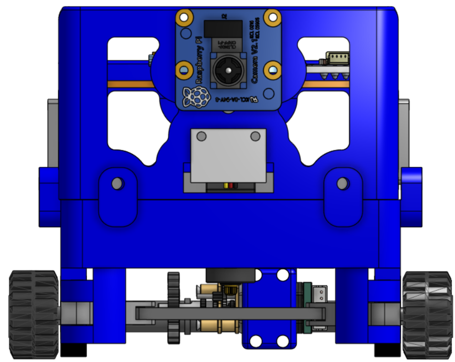
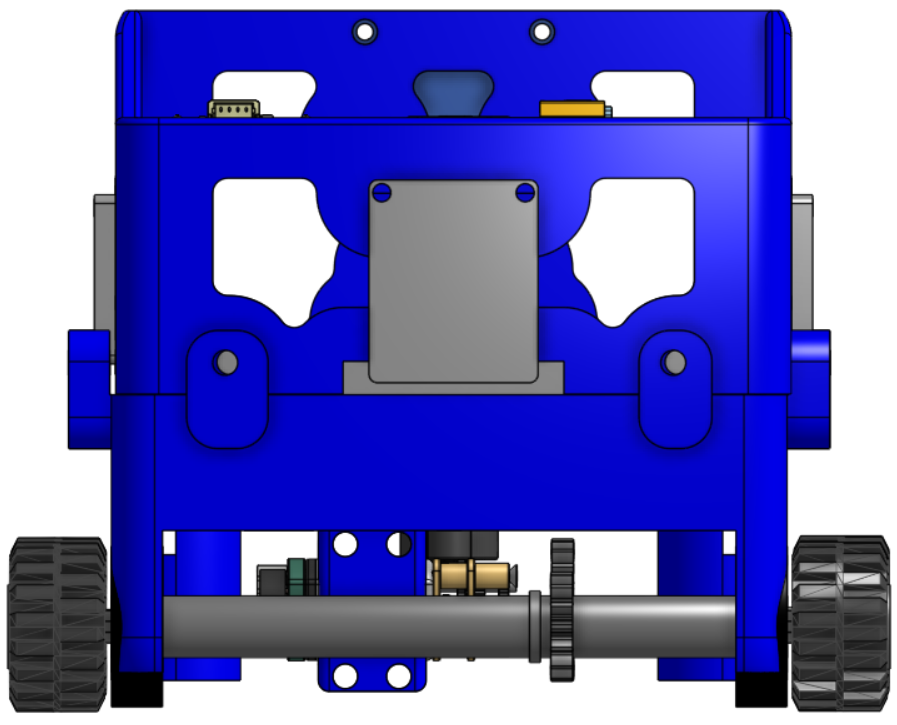
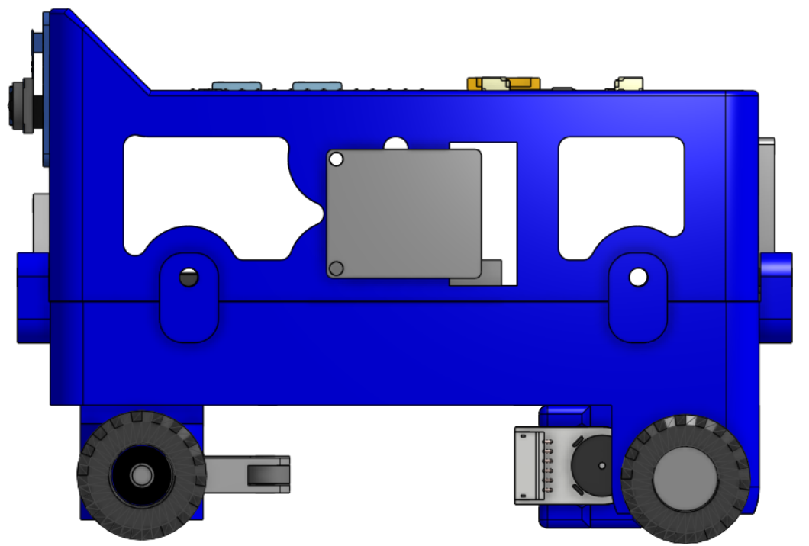
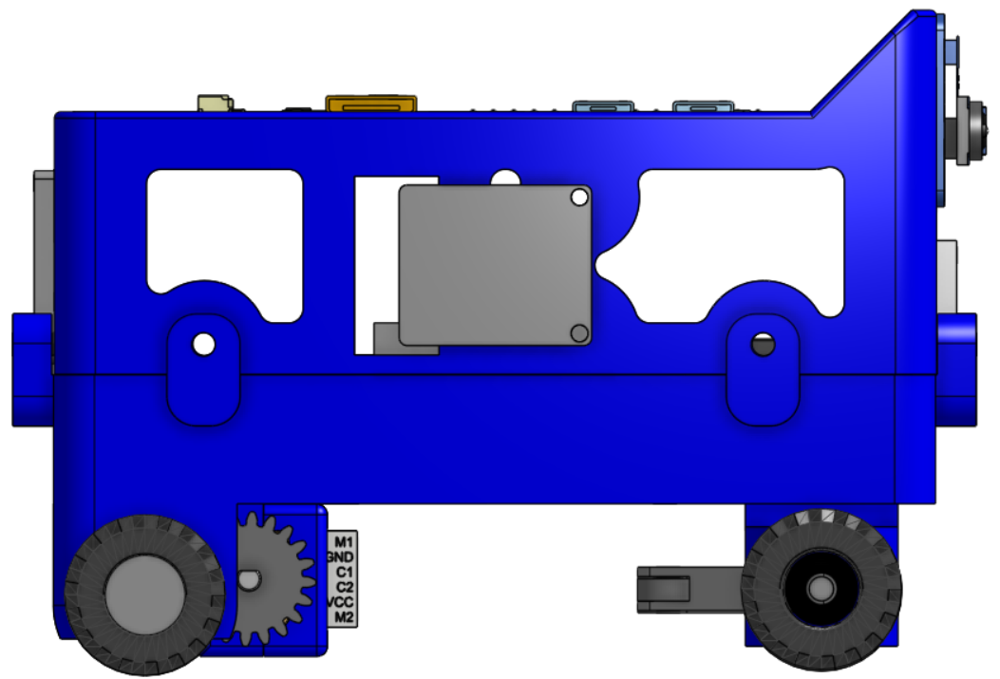
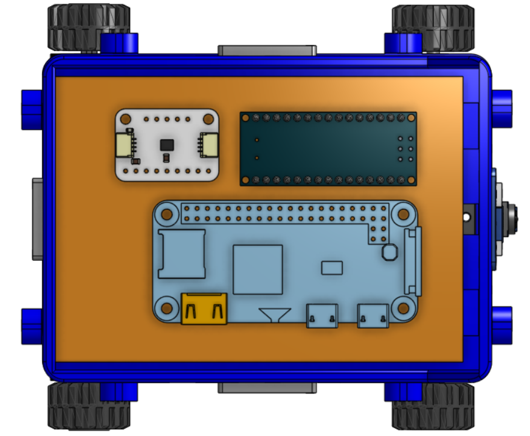
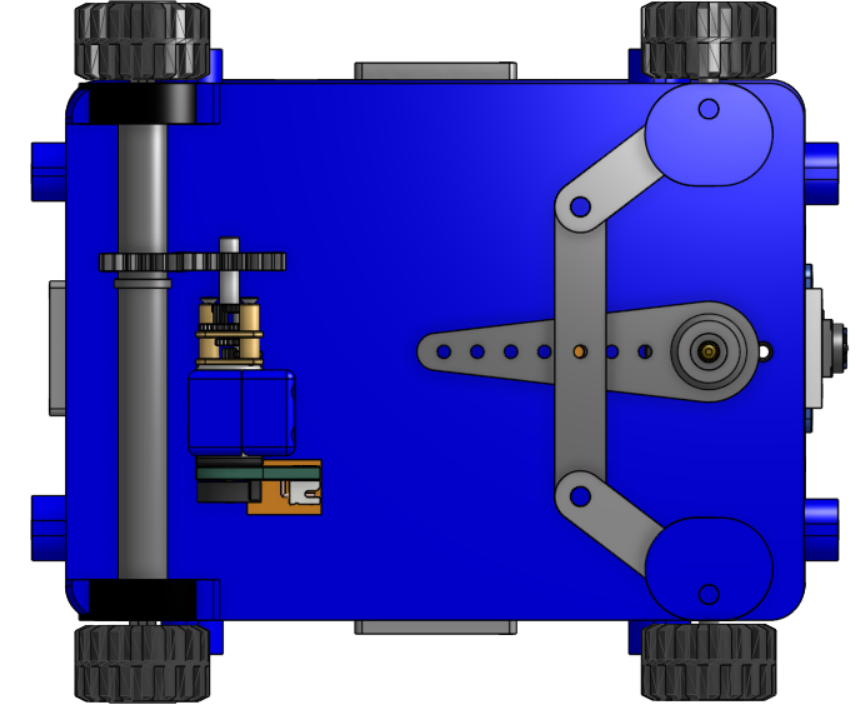

# Vehicle Photos

This folder documents the MadEngineerz WRO 2026 Future Engineers robot from six orthographic views. The images are CAD renders of the complete assembly, and each view is annotated below with the components it makes visible.

## Photo List

### Front View — 

**Focus: forward sensing and front steering assembly**

* Raspberry Pi Camera mounted centrally on the front face of the upper structure
* Forward facing sensor module below the camera
* Front wheels and their steering pivots
* Steering linkage visible beneath the chassis, spanning both front knuckles
* Two part chassis with the upper frame lightening apertures and the lower section below

### Rear View — 

**Focus: rear axle and drivetrain**

* Rear drive axle spanning the full width of the vehicle
* Axle gear mounted on the shaft
* Rear wheels on the printed rims
* Lower section apertures around the drivetrain
* Upper frame with the electronics deck edge and connector visible along the top

### Left View — 

**Focus: side profile and chassis architecture**

* Interface line between the upper and lower chassis sections, with the screw bosses that join them
* Lightening apertures in the upper frame
* Camera visible at the front edge of the vehicle
* Front and rear wheels showing the wheelbase
* Sensor module mounted low at the rear of the chassis

### Right View — 

**Focus: transmission and motor installation**

* N20 motor mounted at the rear of the lower section, with its encoder connector labelling visible
* Motor pinion engaging the drivetrain
* Interface between the upper and lower chassis sections
* Lightening apertures in the upper frame
* Camera visible at the front edge of the vehicle

### Top View — 

**Focus: electronics deck layout**

* Perfboard covering the upper section, forming the electronics platform
* Raspberry Pi Zero 2 W mounted centrally on the deck
* Arduino Nano at the rear of the deck
* LSM6DSOX IMU alongside the Nano
* All four wheels visible at the corners, showing the vehicle footprint

### Bottom View — 

**Focus: drivetrain and Ackermann steering mechanism**

* Rear drive axle with the spur gear pair, showing the motor pinion meshing with the axle gear
* N20 motor mounted transversely alongside the axle
* Steering servo with its horn driving the centre of the steering linkage
* Steering linkage connecting to both steering knuckles
* Steering knuckles pivoting in the chassis lugs at the front corners
* All four wheels, showing the track and wheelbase relationship

## Notes

These six views document the robot from every principal direction and are intended to show component placement and the layout of the mechanical, electrical and sensing systems. All images are CAD renders of the assembled vehicle.

## Technical Documentation

| Area | Documentation |
|---|---|
| Mechanical design and manufacturing files | [Models](../models/README.md) |
| Electrical design and schematics | [Schemes](../schemes/README.md) |
| Software implementation | [Source](../src/README.md) |
| Component references and research | [Other](../other/README.md) |

*Team MadEngineerz, WRO 2026 Future Engineers*
